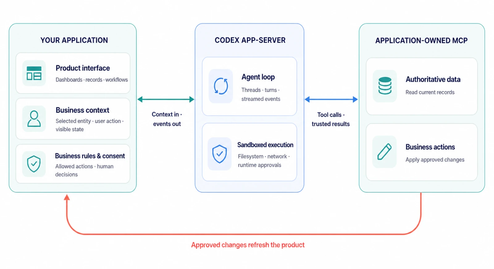
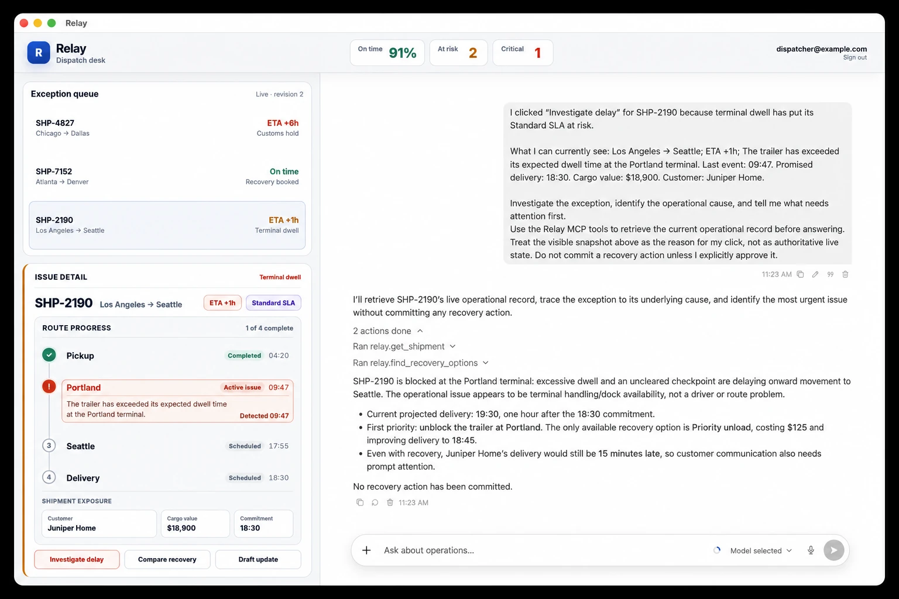

# Codex as a platform: build on the open agent harness
# Codex 即平台：构建于开放的 Agent Harness 之上

Build Codex into the products and workflows your users already know.

将 Codex 融入用户已经熟悉的产品和工作流。

Published Aug 19, 2026

发布于 2026 年 8 月 19 日

Authors: Nicolas Bonamy, Derrick Choi

作者：Nicolas Bonamy、Derrick Choi

[Original article](https://learn.chatgpt.com/blog/codex-as-a-platform) · [原文链接](https://learn.chatgpt.com/blog/codex-as-a-platform)

---

---

Most people know Codex through the [App](https://learn.chatgpt.com/docs/app), [Command-Line Interface](https://learn.chatgpt.com/docs/codex/cli), or [IDE Extension](https://learn.chatgpt.com/docs/codex/ide). Those experiences are important, but they are only a few of the ways the same underlying system can be used.

大多数人通过 [App](https://learn.chatgpt.com/docs/app)、[命令行界面](https://learn.chatgpt.com/docs/codex/cli)或 [IDE 扩展](https://learn.chatgpt.com/docs/codex/ide)认识 Codex。这些体验固然重要，但它们只是同一套底层系统的少数几种使用方式。

---

The [open-source Codex harness](https://github.com/openai/codex) is what powers all these experiences. It helps models gather context, reason through tasks, use tools, operate within configured boundaries, request approval, and carry work forward.

所有这些体验都由[开源 Codex harness](https://github.com/openai/codex) 提供动力。它帮助模型收集上下文、推理任务、使用工具、在配置好的边界内运行、请求审批，并持续推进工作。

---

That changes what developers can build. Instead of asking every team to move its work into a general-purpose coding assistant, you can bring the agent into software designed around the actual job: an engineering workflow, an operations dashboard, a security investigation, a customer-support console, or an internal application built for one specialized team.

这改变了开发者能够构建的东西。你不必要求每个团队都把工作迁移到一个通用编程助手里，而可以把 Agent 带进围绕实际工作设计的软件中：工程工作流、运维仪表盘、安全调查、客户支持控制台，或为某个专业团队打造的内部应用。

---

## The reusable part is the agent loop
## 可复用的部分是 Agent 循环

---

A capable agent is more than a prompt and a model response. It needs a way to understand a task, maintain context over time, inspect relevant information, call tools, expose progress, handle failures, request human approval when necessary, and return a useful result.

一个有能力的 Agent 不只是一个 Prompt 加一次模型响应。它需要一套机制来理解任务、长期维护上下文、检查相关信息、调用工具、展示进度、处理故障、在必要时请求人工审批，并返回有用的结果。

---

That surrounding execution system is the harness.

围绕模型的这套执行系统，就是 harness。

---

Harness design can materially change results: on [ARC-AGI-3](https://openai.com/index/how-two-settings-tripled-our-arc-agi-3-scores/), retained reasoning and context compaction raised GPT-5.6 Sol's score from 13.3% to 38.3% while reducing output tokens sixfold.

Harness 的设计会对结果产生实质性影响：在 [ARC-AGI-3](https://openai.com/index/how-two-settings-tripled-our-arc-agi-3-scores/) 上，保留推理过程与上下文压缩将 GPT-5.6 Sol 的得分从 13.3% 提高到 38.3%，同时把输出 token 数量降低到原来的六分之一。

---

We built the Codex harness to manage conversation state, stream execution, use tools, enforce configured sandbox and approval policies, and carry work across turns. With [Codex app-server](https://learn.chatgpt.com/docs/app-server), we expose those capabilities through a documented client protocol: applications can create threads, start turns, receive events, and handle approval requests.

我们构建 Codex harness，用它管理对话状态、流式传递执行过程、使用工具、执行配置好的沙箱与审批策略，并跨多个对话轮次持续推进工作。通过 [Codex app-server](https://learn.chatgpt.com/docs/app-server)，我们以一套有完整文档的客户端协议开放这些能力：应用可以创建任务、启动对话轮次、接收事件并处理审批请求。

---

If you are building software that needs an agent, you can start with Codex instead of inventing a new runtime, then decide what the surrounding application should own.

如果你正在构建需要 Agent 的软件，可以从 Codex 起步，而不必重新发明一套运行时；然后再决定外围应用应当负责哪些部分。

---

## An open harness developers can inspect and adapt
## 开放、可供开发者检查和改造的 harness

---

Because the harness is open source, you can inspect the layer between your application and the model, understand how it behaves, and adapt the integration to fit your product.

由于 harness 是开源的，你可以检查应用与模型之间的这一层，理解它的行为方式，并调整集成方案以适配自己的产品。

---

That gives developers control over the parts that make the agent fit their product:

这让开发者能够掌控那些决定 Agent 是否适合其产品的部分：

- **The interface.** A team can keep its existing dashboards, editors, queues, maps, records, and approval flows instead of forcing every interaction into a generic chat window.
- **Context and tools.** An application can expose the systems, documents, data, and actions that matter for a particular workflow, including application-owned [MCP services](https://learn.chatgpt.com/docs/extend/mcp).
- **Operational boundaries.** The host application can decide where an agent runs, which files or tools it can access, which actions require approval, how work is observed, and how results return to the system of record.

- **界面。** 团队可以保留已有的仪表盘、编辑器、队列、地图、记录和审批流程，而不必把所有交互都强行塞进一个通用聊天窗口。
- **上下文与工具。** 应用可以开放特定工作流真正需要的系统、文档、数据和操作，包括由应用自身提供的 [MCP 服务](https://learn.chatgpt.com/docs/extend/mcp)。
- **运行边界。** 宿主应用可以决定 Agent 在哪里运行、能够访问哪些文件或工具、哪些操作需要审批、如何观察工作过程，以及结果如何写回权威记录系统。

---

We publish the [Codex CLI](https://learn.chatgpt.com/docs/codex/cli), [app-server](https://learn.chatgpt.com/docs/app-server), and [official Codex SDK](https://learn.chatgpt.com/docs/codex-sdk) as open-source components. Our [open-source components guide](https://learn.chatgpt.com/docs/open-source) lists what is available and where each component lives.

我们以开源组件的形式发布了 [Codex CLI](https://learn.chatgpt.com/docs/codex/cli)、[app-server](https://learn.chatgpt.com/docs/app-server) 和[官方 Codex SDK](https://learn.chatgpt.com/docs/codex-sdk)。我们的[开源组件指南](https://learn.chatgpt.com/docs/open-source)列出了现有组件及其所在位置。

---

The open-source layer is the harness and integration surface; model access and managed services remain separate.

开源的是 harness 与集成接口层；模型访问和托管服务仍然与之分离。

---

## Choose the right integration layer
## 选择合适的集成层

---

Building on Codex does not require the same integration for every use case.

基于 Codex 构建产品，并不意味着所有使用场景都必须采用同一种集成方式。

- For a script, CI job, or one-off background task, [`codex exec`](https://learn.chatgpt.com/docs/non-interactive-mode) can run a bounded agent workflow and return structured output.
- For application code that needs to start, resume, or stream Codex tasks, the [official Codex SDK](https://learn.chatgpt.com/docs/codex-sdk) provides a direct programmatic interface.

- 对于脚本、CI 作业或一次性的后台任务，[`codex exec`](https://learn.chatgpt.com/docs/non-interactive-mode) 可以运行一个有明确边界的 Agent 工作流，并返回结构化输出。
- 对于需要启动、恢复或流式传递 Codex 任务的应用代码，[官方 Codex SDK](https://learn.chatgpt.com/docs/codex-sdk) 提供了直接的编程接口。

---

For a runnable example, see the [Codex SDK documentation](https://learn.chatgpt.com/docs/codex-sdk).

如需可运行的示例，请参阅 [Codex SDK 文档](https://learn.chatgpt.com/docs/codex-sdk)。

---

Use Codex app-server when the agent is part of the product itself. It lets your application connect to a local Codex process, keep conversations open, stream events, interrupt work, expose tools, and respond to approval requests. The SDK simplifies common programmatic workflows; app-server gives product teams direct control over the lifecycle and user experience.

当 Agent 本身就是产品的一部分时，应使用 Codex app-server。它允许应用连接本地 Codex 进程、保持对话开启、流式传递事件、中断工作、开放工具，并响应审批请求。SDK 简化了常见的编程式工作流；app-server 则让产品团队能够直接控制生命周期与用户体验。

---

## Build software around the workflow
## 围绕工作流构建软件

---

The most interesting opportunity is not to reproduce the Codex app with a different logo, but to build software that reflects how a specific person or team already works:

最值得关注的机会，不是给 Codex App 换一个标志后重新做一遍，而是构建能够反映特定个人或团队现有工作方式的软件：

---

A security analyst might need an investigation queue, recent alerts, affected services, and an approval step before opening a remediation ticket. A support engineer might need account history, product logs, internal documentation, and a draft response. A product team might want a task board where moving an issue into a ready state begins a scoped implementation workflow.

安全分析师可能需要调查队列、近期告警、受影响的服务，以及在创建修复工单前执行一次审批。支持工程师可能需要账户历史、产品日志、内部文档和回复草稿。产品团队可能希望使用一个任务看板：当问题被移入“就绪”状态时，自动启动一个范围明确的实现工作流。

---

In each example, the interface is an important part of the experience. It tells the agent what the user is looking at, gives it the right tools, and gives the user a place to review what happens next.

在每个例子中，界面都是体验的重要组成部分。它告诉 Agent 用户正在查看什么，为 Agent 提供合适的工具，也为用户提供一个审核后续操作的地方。

---

*Figure 1. Your application owns product context, business rules, and tools; Codex app-server provides the agent loop and sandboxed execution.*

*图 1：你的应用负责产品上下文、业务规则和工具；Codex app-server 提供 Agent 循环和沙箱化执行。*

---

## Example: Relay
## 示例：Relay

---

We built Relay as a sample operations application on Codex app-server. It places an agent beside a fictional shipment dashboard, connects it to application-owned MCP tools, and requires human approval before a shipment is rebooked.

我们基于 Codex app-server 构建了示例运维应用 Relay。它在一个虚构的货运仪表盘旁嵌入 Agent，将 Agent 连接到应用自有的 MCP 工具，并要求在重新安排货运前获得人工审批。

---

The user does not start by writing a prompt from scratch. They select a shipment and click an action such as *Compare recovery*. The application supplies the relevant context, Codex retrieves the latest sample operational data, the agent explains the available options, and any consequential write requires approval.

用户不需要从零开始编写 Prompt。他们只需选择一票货运，然后点击“比较恢复方案”（*Compare recovery*）之类的操作。应用会提供相关上下文，Codex 获取最新的示例运营数据，Agent 解释可用选项，而任何会产生实际影响的写操作都需要经过审批。

---

Codex can then use the application's MCP tools to fetch current data before recommending—or, after approval, taking—an action. When a tool changes the underlying record, the application refreshes its business view. The harness handles the agent loop, conversation state, streamed activity, and tool interaction; the product continues to own its dashboard, records, and controls.

随后，Codex 可以使用应用的 MCP 工具获取当前数据，再提出操作建议；获得批准后，也可以直接执行操作。当工具修改底层记录时，应用会刷新业务视图。Harness 负责 Agent 循环、对话状态、流式活动和工具交互；产品则继续掌控自己的仪表盘、记录和控制机制。

---

Relay uses fictional seeded data, but the integration pattern is general. The same pattern could power incident response, account operations, research workflows, or other applications where an agent should work inside an existing product experience.

Relay 使用虚构的预置数据，但这种集成模式具有普适性。同一种模式可以用于事件响应、账户运营、研究工作流，或其他需要 Agent 在现有产品体验中工作的应用。

---

*Figure 2. Relay embeds Codex in a shipment operations dashboard, with application-owned MCP tools and human approval for consequential actions.*

*图 2：Relay 将 Codex 嵌入货运运营仪表盘，通过应用自有的 MCP 工具工作，并要求对有实际影响的操作进行人工审批。*

---

## What developers are building
## 开发者正在构建什么

---

This pattern is already showing up in public implementations:

这种模式已经出现在公开实现中：

- [GitHub and JetBrains](https://github.blog/changelog/2026-07-07-codex-as-agent-provider-and-agentic-enhancements-in-jetbrains-ides/) bring Codex into existing IDE workflows.
- [Cisco](https://blogs.cisco.com/ai/from-an-idea-to-a-live-app-on-cisco-in-minutes) uses the Codex SDK in App Builder inside Cisco Cloud Control.
- [Thrive Holdings and Crete](https://openai.com/index/building-self-improving-tax-agents-with-codex/) use Codex in a tax-preparation workflow that incorporates practitioner feedback. Their pilot processed 7,000 returns and reduced preparation time by about a third.

- [GitHub 和 JetBrains](https://github.blog/changelog/2026-07-07-codex-as-agent-provider-and-agentic-enhancements-in-jetbrains-ides/) 将 Codex 带入现有的 IDE 工作流。
- [Cisco](https://blogs.cisco.com/ai/from-an-idea-to-a-live-app-on-cisco-in-minutes) 在 Cisco Cloud Control 内的 App Builder 中使用 Codex SDK。
- [Thrive Holdings 和 Crete](https://openai.com/index/building-self-improving-tax-agents-with-codex/) 将 Codex 用于一个吸收专业从业者反馈的报税工作流。他们的试点处理了 7,000 份税表，并将准备时间缩短了约三分之一。

---

These examples are not limited to engineering: the same pattern applies to support teams investigating customer issues, operations teams coordinating workflows, security teams triaging incidents, sales teams researching accounts, and marketing teams developing campaigns. In each case, the application provides the context, tools, and approvals, while Codex powers the underlying agent loop.

这些例子并不局限于工程领域：同一种模式也适用于调查客户问题的支持团队、协调工作流的运营团队、分诊安全事件的安全团队、研究客户账户的销售团队，以及策划营销活动的市场团队。在每种情况下，应用都负责提供上下文、工具和审批机制，而 Codex 则为底层 Agent 循环提供动力。

---

## Build beyond the obvious
## 构建超越直观想象的产品

---

For many kinds of work, the essential context is grounded in a dashboard, a timeline, a map, a document, or a system record. Those views are not there to be pretty: it is how people actually understand what is happening, make decisions, and stay in control.

对于许多类型的工作，关键上下文存在于仪表盘、时间线、地图、文档或系统记录中。这些视图并不只是为了好看：人们正是通过它们理解正在发生的事情、作出决策并保持掌控。

---

The opportunity is not to replace those interfaces with a universal chat box, but to make them more capable by giving them an agent that can understand the work, investigate the right context, propose a next step, and take an approved action.

真正的机会不是用一个万能聊天框取代这些界面，而是为它们配备一个能够理解工作、调查正确上下文、提出下一步建议并执行已获批准操作的 Agent，让这些界面变得更强大。

---

The Codex app, CLI, and IDE extension show what the harness can do. By making the harness open source, we give developers a way to inspect those capabilities, integrate them, and adapt them to their own products and workflows.

Codex App、CLI 和 IDE 扩展展示了 harness 能做什么。通过将 harness 开源，我们为开发者提供了一种检查、集成这些能力，并使其适配自身产品与工作流的方式。

---

If you want to build with the Codex harness, start with the [open-source Codex repository](https://github.com/openai/codex), then choose the integration that fits your product: [`codex exec`](https://learn.chatgpt.com/docs/non-interactive-mode) for noninteractive jobs, the [Codex SDK](https://learn.chatgpt.com/docs/codex-sdk) for programmatic agent workflows, or [Codex app-server](https://learn.chatgpt.com/docs/app-server) for applications that need persistent conversations, streamed events, and approval handling.

如果你想基于 Codex harness 构建产品，可以从[开源 Codex 仓库](https://github.com/openai/codex)开始，然后选择适合产品的集成方式：非交互式作业使用 [`codex exec`](https://learn.chatgpt.com/docs/non-interactive-mode)，编程式 Agent 工作流使用 [Codex SDK](https://learn.chatgpt.com/docs/codex-sdk)，而需要持久对话、流式事件和审批处理的应用则使用 [Codex app-server](https://learn.chatgpt.com/docs/app-server)。
