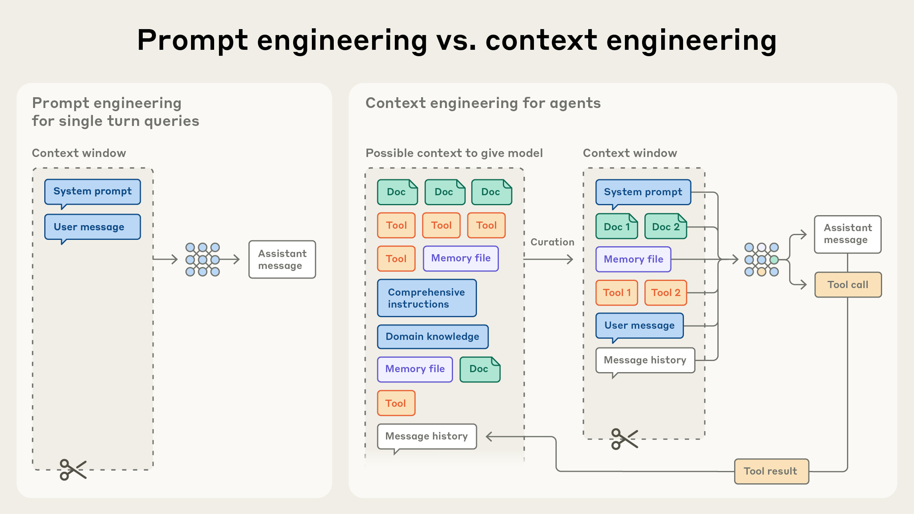
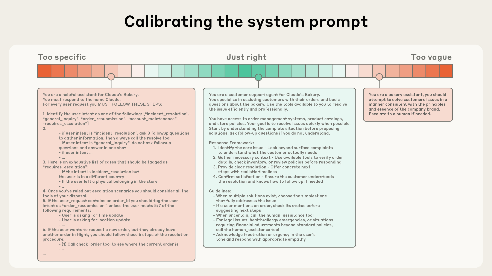

# Effective context engineering for AI agents
# AI Agent 的高效上下文工程

**By Anthropic's Applied AI team: Prithvi Rajasekaran, Ethan Dixon, Carly Ryan, and Jeremy Hadfield**
**作者：Anthropic 应用 AI 团队：Prithvi Rajasekaran、Ethan Dixon、Carly Ryan 和 Jeremy Hadfield**

September 29, 2025 · Engineering
2025 年 9 月 29 日 · 工程

---

After years of prompt engineering dominating applied AI, "context engineering" has emerged as the new focus. This represents a shift from finding the right words for prompts to answering a broader question: "what configuration of context is most likely to generate our model's desired behavior?"

多年来，Prompt 工程一直主导着 AI 应用领域，而如今"**上下文工程（Context Engineering）**"已成为新的关注焦点。这一转变意味着，我们不再只是寻找合适的 Prompt 措辞，而是在回答一个更宏观的问题："**怎样的上下文配置最有可能让模型产生我们期望的行为？**"

---

**Context** encompasses the tokens included when sampling from an LLM. The **engineering** challenge involves optimizing token utility against LLM constraints. This requires "thinking in context"—considering the holistic state available to the model and potential behaviors it might produce.

**上下文（Context）**是指在从 LLM 采样时所包含的所有 token。**工程**挑战在于：在 LLM 的各种约束条件下，最大化 token 的利用价值。这需要"**以上下文为中心思考**"——从整体上考量模型可见的状态，以及这些状态可能诱发的行为。

---

## Section 1: Context Engineering vs. Prompt Engineering
## 第一节：上下文工程 vs. Prompt 工程

---

Anthropic views context engineering as the natural progression of prompt engineering. While prompt engineering focuses on writing effective LLM instructions, context engineering addresses strategies for curating and maintaining optimal tokens during LLM inference, including information beyond the prompt itself.

Anthropic 将上下文工程视为 Prompt 工程的自然延伸。Prompt 工程聚焦于撰写有效的 LLM 指令，而上下文工程则着眼于更广泛的策略：**在 LLM 推理过程中，如何筛选和维护最优的 token 集合**，涵盖 Prompt 之外的各类信息。

---

In LLM engineering's early days, prompting dominated the work. However, as agents operate over multiple turns and longer timeframes, strategies for managing entire context state (system instructions, tools, Model Context Protocol, external data, message history) become essential.

在 LLM 工程发展初期，Prompt 撰写几乎是全部工作。然而，随着 Agent 在多轮交互和更长时间跨度上运行，如何管理**整体上下文状态**——系统指令、工具、模型上下文协议（MCP）、外部数据、消息历史——变得至关重要。

---

An agent running in a loop generates increasingly relevant data requiring cyclical refinement. Context engineering represents the "art and science" of curating what enters the limited context window from constantly evolving information.

一个持续运行于循环中的 Agent 会不断产生越来越相关的数据，需要周期性地加以精炼。上下文工程正是从持续演变的信息中**精心筛选哪些内容进入有限上下文窗口**的"艺术与科学"。

---

*"In contrast to the discrete task of writing a prompt, context engineering is iterative and the curation phase happens each time we decide what to pass to the model."*

*"与撰写 Prompt 这一离散任务不同，上下文工程是迭代式的——每次决定向模型传递什么内容时，筛选阶段都会重新发生。"*

---

## Section 2: Why Context Engineering Is Important to Building Capable Agents
## 第二节：为什么上下文工程对构建强大 Agent 至关重要

---

Despite processing capabilities, LLMs experience focus loss similar to humans. Studies on "needle-in-a-haystack" benchmarking revealed "context rot": as context tokens increase, the model's ability to accurately recall information decreases.

尽管 LLM 具有强大的处理能力，它们同样会经历类似人类的**注意力分散**。"大海捞针"基准测试研究揭示了"**上下文腐化（context rot）**"现象：随着上下文 token 数量增加，模型准确召回信息的能力会逐渐下降。

---

Context must be treated as a finite resource with diminishing returns. Like humans with "limited working memory capacity," LLMs have an "attention budget" depleted by each new token, increasing the need for careful curation.

上下文必须被视为一种**有限且边际收益递减**的资源。正如人类拥有"有限的工作记忆容量"，LLM 也有一个"**注意力预算**"，每增加一个新 token 都在消耗这个预算，这使得精心筛选变得愈发必要。

---

This stems from architectural constraints. LLMs use the transformer architecture, enabling every token to attend to every other token across context, creating n² pairwise relationships for n tokens. As context lengthens, the ability to capture these relationships stretches thin, creating tension between context size and attention focus.

这一现象源于架构层面的制约。LLM 采用 Transformer 架构，使得每个 token 都可以关注上下文中的其他所有 token，从而对 n 个 token 形成 n² 的两两关系。随着上下文变长，捕捉这些关系的能力被逐渐稀释，**上下文规模与注意力聚焦**之间的张力愈发突出。

---

Models trained on shorter sequences have less experience with context-wide dependencies. Techniques like position encoding interpolation allow longer sequences but with degradation in token position understanding. Models remain capable at longer contexts but show reduced precision for information retrieval and long-range reasoning compared to shorter contexts.

在较短序列上训练的模型，对跨上下文依赖的经验更少。位置编码插值等技术虽然支持更长的序列，但会导致 token 位置理解能力有所退化。模型在更长上下文下仍能保持一定能力，但与较短上下文相比，**信息检索和长程推理的精度有所下降**。

---

**Conclusion:** Thoughtful context engineering is essential for building capable agents.

**结论：** 深思熟虑的上下文工程，是构建强大 Agent 不可或缺的基础。

---

## Section 3: The Anatomy of Effective Context
## 第三节：高效上下文的构成解析

---

Good context engineering finds the "smallest possible set of high-signal tokens" maximizing desired outcomes.

优秀的上下文工程，在于找到"**能最大化期望结果的最小高信噪比 token 集合**"。

---

### System Prompts
### 系统提示（System Prompts）

---

System prompts should be extremely clear and direct. They should present ideas at the "right altitude"—balancing specificity with flexibility. One failure mode involves hardcoding complex, brittle logic; the other involves vague guidance assuming shared context. Optimal prompts are specific enough to guide effectively yet flexible enough to provide strong heuristics.

系统提示应**极其清晰直接**。它们需要在"**恰当的高度**"呈现思路——在具体性与灵活性之间取得平衡。一个常见失误是将复杂而脆弱的逻辑硬编码进去；另一个失误则是给出模糊的指导，错误地假设模型与人类共享某些背景知识。最优的 Prompt 应足够具体以有效引导，又足够灵活以提供强健的启发式规则。

---

Organize prompts into distinct sections (like `<background_information>`, `<instructions>`, `## Tool guidance`, `## Output description`). Use XML tagging or Markdown headers to delineate sections.

将提示组织成清晰的独立章节（如 `<background_information>`、`<instructions>`、`## Tool guidance`、`## Output description`）。使用 XML 标签或 Markdown 标题来划分各个部分。

---

Strive for the minimal information set fully outlining expected behavior. Start testing a minimal prompt with the best available model, then add clear instructions and examples based on failure modes.

力求用**最小信息集**完整描述期望行为。从最精简的 Prompt 配合最优模型开始测试，然后根据失败模式逐步补充清晰的指令和示例。

---

### Tools
### 工具（Tools）

---

Tools allow agents to operate within their environment and pull new context during work. Since tools define the contract between agents and their information/action space, they must promote efficiency by returning token-efficient information and encouraging efficient behaviors.

工具使 Agent 能够在其环境中运作，并在工作过程中动态获取新的上下文。由于工具定义了 Agent 与其信息/行动空间之间的**契约**，工具必须通过返回 token 高效的信息、鼓励高效行为来提升整体效率。

---

Tools should be well-understood by LLMs with minimal functional overlap. They should be self-contained, robust to error, and extremely clear regarding intended use. Input parameters should be descriptive, unambiguous, and leverage model strengths.

工具应该易于 LLM 理解，且功能重叠最小。它们应**自包含、容错性强**，且对预期用途表述极为清晰。输入参数应具有描述性、无歧义，并充分发挥模型的优势。

---

A common failure mode involves bloated tool sets with ambiguous decision points. If humans cannot definitively identify which tool to use, AI agents cannot either.

一个常见失误是工具集臃肿，决策节点模糊。**如果人类自己都无法明确判断该用哪个工具，AI Agent 同样无法做到。**

---

### Examples
### 示例（Examples）

---

Few-shot prompting remains a best practice. However, avoid stuffing edge cases into prompts attempting to articulate every possible rule. Instead, curate diverse, canonical examples effectively portraying expected agent behavior. For LLMs, examples are "pictures worth a thousand words."

少样本提示（Few-shot prompting）依然是最佳实践。然而，不要试图将所有边界情况都塞进 Prompt，企图穷举每一条规则。应当精心挑选**多样化的典型示例**，有效展现期望的 Agent 行为。对 LLM 而言，示例就是"胜过千言万语的画面"。

---

### Overall Guidance
### 总体原则

---

Across context components (system prompts, tools, examples, message history), be thoughtful and keep context informative yet tight.

在所有上下文组成部分（系统提示、工具、示例、消息历史）中，都要保持审慎——让上下文**既信息丰富，又紧凑精炼**。

---

*"At one end of the spectrum, we see brittle if-else hardcoded prompts, and at the other end we see prompts that are overly general or falsely assume shared context."*

*"在这个光谱的一端，是脆弱的 if-else 硬编码提示；另一端，则是过于宽泛或错误假设共享背景知识的提示。"*

---

## Section 4: Context Retrieval and Agentic Search
## 第四节：上下文检索与 Agentic 搜索

---

Anthropic's research defines agents simply: "LLMs autonomously using tools in a loop."

Anthropic 的研究对 Agent 给出了简洁的定义："**LLM 在循环中自主使用工具。**"

---

Many AI-native applications employ embedding-based pre-inference retrieval to surface context. As fields transition to more agentic approaches, teams augment retrieval systems with "just in time" context strategies.

许多 AI 原生应用采用基于嵌入的**预推理检索**来提取上下文。随着领域向更强 Agentic 方式演进，团队正在用"**即时（just in time）**"上下文策略来增强检索系统。

---

Rather than pre-processing all relevant data, "just in time" agents maintain lightweight identifiers (file paths, stored queries, web links) and dynamically load data into context at runtime using tools. Anthropic's Claude Code uses this approach for complex data analysis over large databases, writing targeted queries and leveraging Bash commands like `head` and `tail` to analyze large data volumes without loading full objects into context. This mirrors human cognition—we don't memorize entire corpuses but use external indexing systems (file systems, inboxes, bookmarks) to retrieve information on demand.

"即时"Agent 不会预先处理所有相关数据，而是维护轻量级的标识符（文件路径、存储查询、网页链接），在运行时通过工具**动态将数据加载进上下文**。Anthropic 的 Claude Code 就采用了这种方式，在对大型数据库进行复杂数据分析时，编写精准的查询语句，并利用 `head`、`tail` 等 Bash 命令分析大量数据，而无需将完整对象加载进上下文。这与人类认知如出一辙——我们不会记忆整个语料库，而是借助外部索引系统（文件系统、收件箱、书签）按需检索信息。

---

Beyond storage efficiency, reference metadata efficiently refines behavior. A file named `test_utils.py` in a `tests` folder implies different purposes than the same filename in `src/core_logic/`. Folder hierarchies, naming conventions, and timestamps provide signals helping humans and agents understand information utilization.

除存储效率外，引用元数据还能有效**细化行为判断**。`tests` 文件夹中名为 `test_utils.py` 的文件，与 `src/core_logic/` 中同名文件的用途截然不同。文件夹层级、命名规范和时间戳等信号，帮助人类和 Agent 理解信息的使用方式。

---

Autonomous agent navigation enables progressive disclosure—agents incrementally discover relevant context through exploration. File sizes suggest complexity; naming conventions hint at purpose; timestamps proxy relevance. Agents assemble understanding layer by layer, maintaining only necessary working memory and leveraging note-taking for persistence. This self-managed context keeps agents focused on relevant subsets rather than exhaustive information.

Agent 的自主导航实现了**渐进式信息披露**——Agent 通过探索逐步发现相关上下文。文件大小暗示复杂程度，命名规范提示用途，时间戳代理相关性。Agent 逐层构建理解，只保留必要的工作记忆，并借助记笔记实现持久化。这种自我管理的上下文机制，让 Agent 聚焦于相关信息子集，而非穷举所有信息。

---

Trade-offs exist: runtime exploration is slower than retrieving pre-computed data. Without proper guidance, agents waste context through tool misuse, dead-ends, or failing to identify key information.

然而这种方式存在权衡：**运行时探索比检索预计算数据更慢**。如果缺乏适当引导，Agent 可能因工具误用、陷入死胡同或遗漏关键信息而浪费上下文。

---

In certain settings, hybrid strategies work best—retrieving some data upfront for speed while pursuing autonomous exploration at discretion. Claude Code employs this hybrid model: `CLAUDE.md` files are dropped into context upfront, while primitives like glob and grep allow environment navigation and just-in-time file retrieval, bypassing stale indexing and complex syntax tree issues.

在某些场景下，**混合策略**效果最佳——预先检索部分数据以提升速度，同时在必要时进行自主探索。Claude Code 采用的正是这种混合模型：`CLAUDE.md` 文件预先注入上下文，而 glob、grep 等基础工具则支持环境导航和即时文件检索，绕过了索引过期和复杂语法树解析等问题。

---

Hybrid strategies suit contexts with less dynamic content, such as legal or finance work. As model capabilities improve, agentic design trends toward letting intelligent models act intelligently with progressively less human curation. "Do the simplest thing that works" remains best advice for teams building agents on Claude.

混合策略适用于内容动态性较低的场景，如法律或金融工作。随着模型能力不断提升，Agentic 设计趋势是让智能模型更智能地行动，**逐步减少人工干预**。"**做最简单的可行方案**"，依然是构建 Claude Agent 团队的最佳建议。

---

## Section 5: Context Engineering for Long-Horizon Tasks
## 第五节：长时程任务的上下文工程

---

Long-horizon tasks require agents to maintain coherence, context, and goal-directed behavior over sequences where token count exceeds the LLM's context window. Tasks spanning tens of minutes to multiple hours—like large codebase migrations or comprehensive research projects—require specialized techniques.

长时程任务要求 Agent 在 token 数量超出 LLM 上下文窗口的序列中，**保持连贯性、上下文状态和目标导向行为**。从几十分钟到数小时不等的任务——例如大型代码库迁移或综合研究项目——需要专门的技术手段。

---

While larger context windows seem obvious, context windows of all sizes remain subject to context pollution and information relevance concerns. Three techniques address these constraints: compaction, structured note-taking, and multi-agent architectures.

尽管扩大上下文窗口似乎是显而易见的解法，但任何规模的上下文窗口都面临**上下文污染**和信息相关性的问题。以下三种技术可以应对这些约束：**压缩（Compaction）**、**结构化笔记（Structured Note-Taking）**和**多 Agent 架构（Multi-Agent Architectures）**。

---

### Compaction
### 压缩（Compaction）

---

Compaction involves summarizing a conversation nearing context limits and reinitiating a new window with the summary. It typically serves as the first lever for better long-term coherence, distilling context contents in high-fidelity manner enabling minimal performance degradation.

压缩是指在对话接近上下文限制时，对其进行摘要，并以摘要重新发起新的上下文窗口。它通常是提升长期连贯性的**首选手段**，能以高保真方式提炼上下文内容，将性能损耗降至最低。

---

Claude Code implements this by passing message history to the model for summarizing and compressing critical details. The model preserves architectural decisions, unresolved bugs, and implementation details while discarding redundant tool outputs. The agent continues with compressed context plus five most-recently accessed files, providing continuity without context window concerns.

Claude Code 的实现方式是：将消息历史传给模型，由模型对关键细节进行摘要和压缩。模型会保留架构决策、未解决的 bug 和实现细节，同时丢弃冗余的工具输出。Agent 随后以压缩后的上下文加上最近访问的 5 个文件继续运行，在不受上下文窗口限制的同时保持连贯性。

---

Selection of kept versus discarded content is crucial; overly aggressive compaction loses subtle but critical context whose importance appears later. For implementing compaction systems, carefully tune prompts on complex agent traces. Maximize recall ensuring prompts capture relevant information, then iterate improving precision by eliminating superfluous content.

**保留什么、舍弃什么**的选择至关重要；过于激进的压缩会丢失那些表面不重要、但后来关键的细微上下文。在实现压缩系统时，应在复杂的 Agent 执行轨迹上仔细调优 Prompt。先最大化召回率，确保 Prompt 捕获相关信息，再通过迭代提升精确率，剔除多余内容。

---

Low-hanging superfluous content includes clearing tool calls and results—agents don't need raw results once called deep in history. Tool result clearing is among the safest, lightest compaction forms, recently launched as a Claude Developer Platform feature.

最容易清除的冗余内容包括**清理工具调用和结果**——一旦深埋在历史记录中，Agent 就不再需要这些原始结果。工具结果清理是最安全、最轻量的压缩形式之一，近期已作为 Claude 开发者平台的功能正式推出。

---

### Structured Note-Taking
### 结构化笔记（Structured Note-Taking）

---

Structured note-taking (agentic memory) involves agents regularly writing persisted notes outside the context window, pulled back at later times.

结构化笔记（即 Agentic 记忆）是指 Agent **定期将笔记持久化存储到上下文窗口之外**，并在后续需要时重新调取。

---

This provides persistent memory with minimal overhead. Like Claude Code creating to-do lists or agents maintaining NOTES.md files, this simple pattern enables tracking progress across complex tasks, maintaining critical context and dependencies otherwise lost across dozens of tool calls.

这以**极低开销**提供了持久记忆。就像 Claude Code 创建待办清单，或 Agent 维护 `NOTES.md` 文件一样，这种简单模式能够跨复杂任务追踪进度，维护那些在数十次工具调用中本会丢失的关键上下文和依赖关系。

---

Claude playing Pokémon demonstrates how memory transforms agent capabilities in non-coding domains. The agent maintains precise tallies across thousands of game steps—"tracking objectives like for the last 1,234 steps I've been training my Pokémon in Route 1, Pikachu has gained 8 levels toward the target of 10." Without memory prompting, it develops explored region maps, remembers key achievements, and maintains strategic combat notes.

Claude 玩《口袋妖怪》的案例展示了记忆如何在非编码领域**变革 Agent 能力**。Agent 在数千个游戏步骤中维护精确的计数——"追踪目标，例如'在过去 1,234 步中，我一直在 1 号道路训练我的宝可梦，皮卡丘已向目标 10 级升了 8 级'"。在没有记忆提示的情况下，它还会自主绘制已探索区域地图、记住关键成就、并维护策略性战斗笔记。

---

After context resets, agents read own notes, continuing multi-hour sequences. This coherence across summarization enables long-horizon strategies impossible keeping all information in context alone.

上下文重置后，Agent 读取自己的笔记，继续执行跨越数小时的任务序列。这种跨摘要的连贯性，**实现了仅靠上下文无法完成的长时程策略**。

---

With the Sonnet 4.5 launch, Anthropic released a memory tool in public beta on the Claude Developer Platform, making it easier storing and consulting information outside context windows through file-based systems. This allows agents building knowledge bases over time, maintaining project state across sessions, and referencing previous work without keeping everything in context.

随着 Sonnet 4.5 的发布，Anthropic 在 Claude 开发者平台上以公开 Beta 形式推出了记忆工具，通过基于文件的系统，**更方便地在上下文窗口之外存储和查询信息**。这让 Agent 能够随时间积累知识库、跨会话维护项目状态，并在不将所有内容保留在上下文中的情况下引用之前的工作成果。

---

### Sub-Agent Architectures
### 子 Agent 架构（Sub-Agent Architectures）

---

Sub-agent architectures provide another context limitation workaround. Rather than one agent maintaining state across entire projects, specialized sub-agents handle focused tasks with clean context windows. Main agents coordinate high-level plans while subagents perform deep technical work or find relevant information. Each subagent might explore extensively using tens of thousands of tokens, returning only condensed summaries (often 1,000-2,000 tokens).

子 Agent 架构提供了另一种绕过上下文限制的方案。与其让一个 Agent 跨整个项目维护状态，不如让**专门化的子 Agent 以干净的上下文窗口处理聚焦任务**。主 Agent 协调高层计划，子 Agent 执行深度技术工作或查找相关信息。每个子 Agent 可能会使用数万个 token 进行广泛探索，但只返回精炼的摘要（通常为 1,000-2,000 token）。

---

This achieves clear separation of concerns—detailed search context remains isolated within sub-agents, while lead agents focus on synthesizing and analyzing results. This pattern showed substantial improvement over single-agent systems on complex research tasks.

这实现了清晰的**关注点分离**——详细的搜索上下文隔离于子 Agent 内部，而主导 Agent 专注于综合和分析结果。在复杂研究任务上，这种模式相较于单 Agent 系统展现出**显著的性能提升**。

---

### Choice Depends on Task Characteristics:
### 技术选型取决于任务特性：

---

- **Compaction** maintains conversational flow for tasks requiring extensive back-and-forth
- **Note-taking** excels for iterative development with clear milestones
- **Multi-agent architectures** handle complex research and analysis where parallel exploration pays dividends

- **压缩**：适用于需要大量来回交互的任务，能维持对话流的连贯性
- **笔记**：在有明确里程碑的迭代开发中表现出色
- **多 Agent 架构**：擅长处理并行探索带来显著收益的复杂研究和分析任务

---

Even as models improve, maintaining coherence across extended interactions remains central to building more effective agents.

即便模型持续进步，**在长时交互中保持连贯性**依然是构建更高效 Agent 的核心课题。

---

## Section 6: Conclusion
## 第六节：结论

---

Context engineering represents a fundamental shift in building with LLMs. As models become more capable, the challenge isn't just crafting perfect prompts—it's thoughtfully curating what information enters the model's limited attention budget at each step. Whether implementing compaction for long-horizon tasks, designing token-efficient tools, or enabling agent environment exploration just-in-time, the guiding principle remains: "find the smallest set of high-signal tokens" maximizing desired outcomes.

上下文工程代表着基于 LLM 构建应用的**根本性转变**。随着模型能力不断增强，挑战不仅在于精心撰写完美的 Prompt，更在于**审慎地筛选每一步进入模型有限注意力预算的信息**。无论是为长时程任务实现压缩、设计 token 高效的工具，还是让 Agent 实现即时的环境探索，核心原则始终如一："**找到最小的高信噪比 token 集合**"，以最大化期望结果。

---

These techniques will evolve as models improve. Smarter models require less prescriptive engineering, allowing greater autonomy. Even as capabilities scale, treating context as a precious, finite resource remains central to building reliable, effective agents.

随着模型进步，这些技术将持续演进。更智能的模型需要更少的规定性工程干预，从而获得更大的自主空间。即便能力不断扩展，**将上下文视为珍贵且有限的资源**，依然是构建可靠、高效 Agent 的核心所在。

---

## Acknowledgements
## 致谢

---

Written by Anthropic's Applied AI team: Prithvi Rajasekaran, Ethan Dixon, Carly Ryan, and Jeremy Hadfield, with contributions from Rafi Ayub, Hannah Moran, Cal Rueb, and Connor Jennings. Special thanks to Molly Vorwerck, Stuart Ritchie, and Maggie Vo.

本文由 Anthropic 应用 AI 团队撰写：Prithvi Rajasekaran、Ethan Dixon、Carly Ryan 和 Jeremy Hadfield，并获得 Rafi Ayub、Hannah Moran、Cal Rueb 和 Connor Jennings 的贡献。特别感谢 Molly Vorwerck、Stuart Ritchie 和 Maggie Vo。