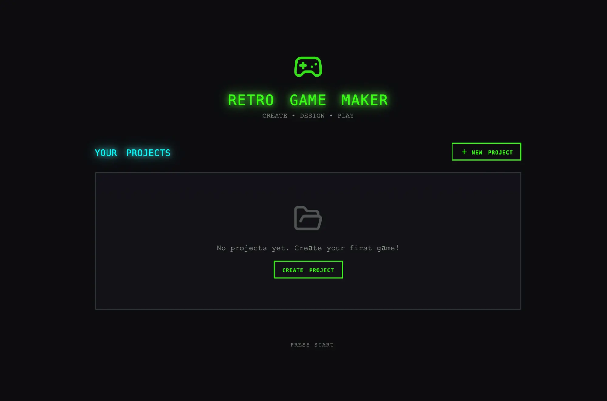
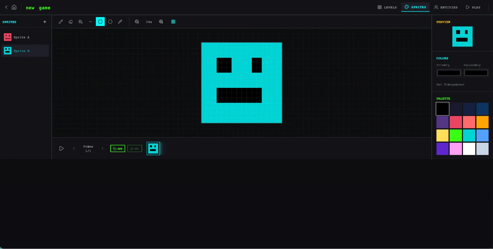
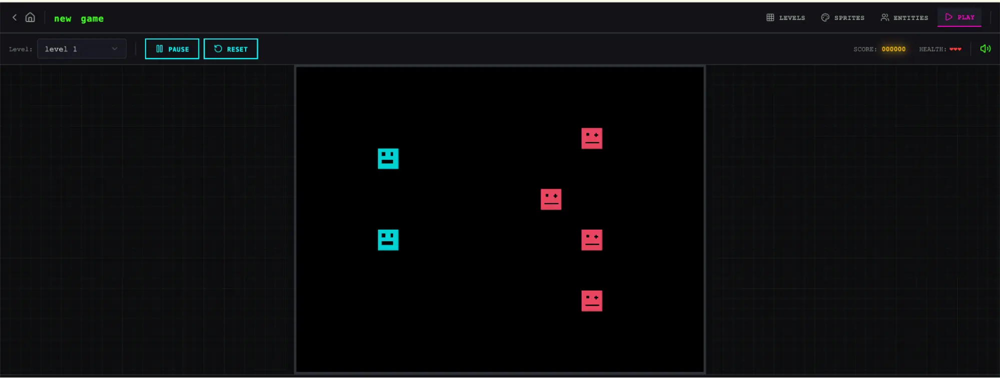
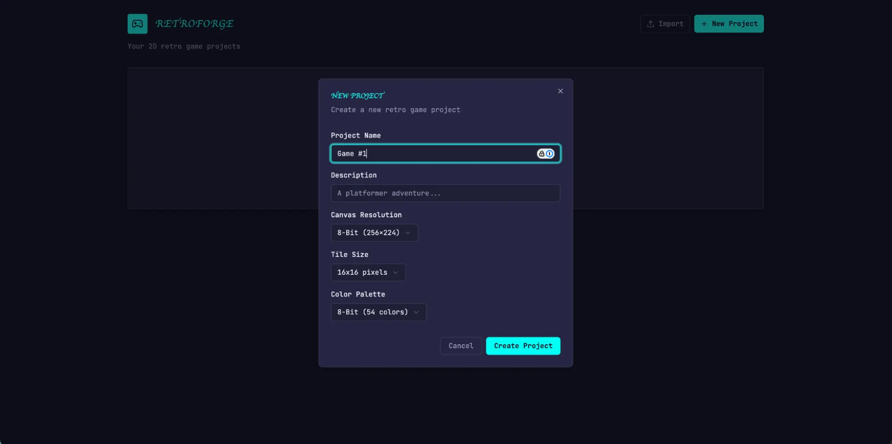
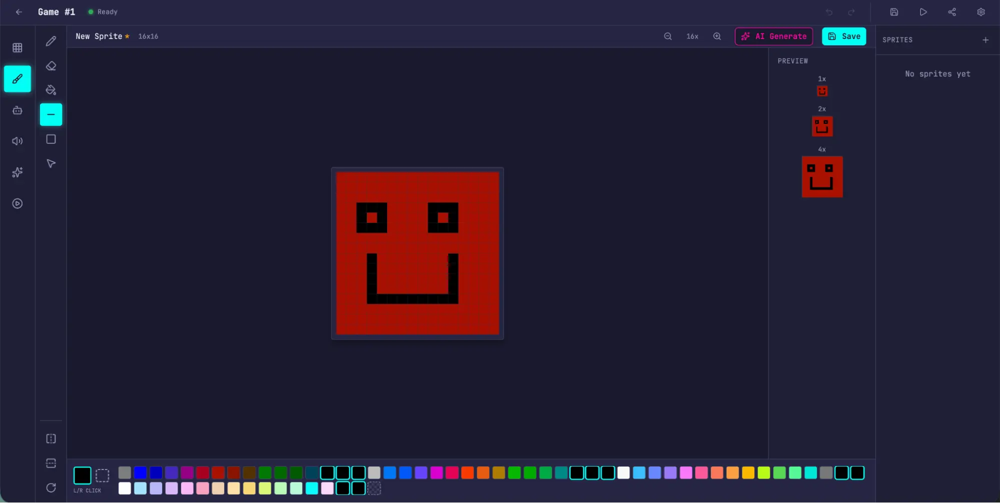
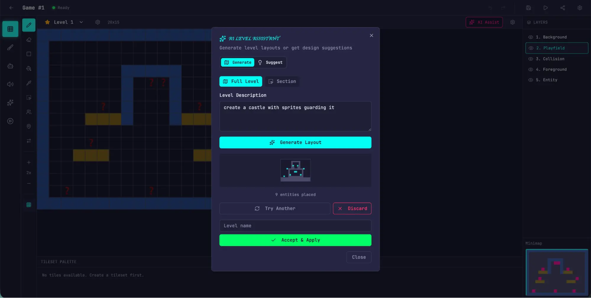
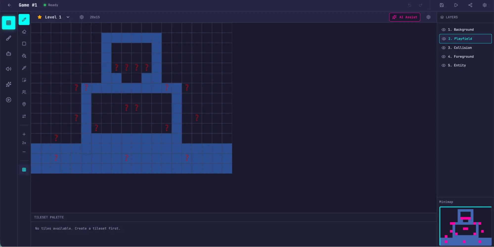
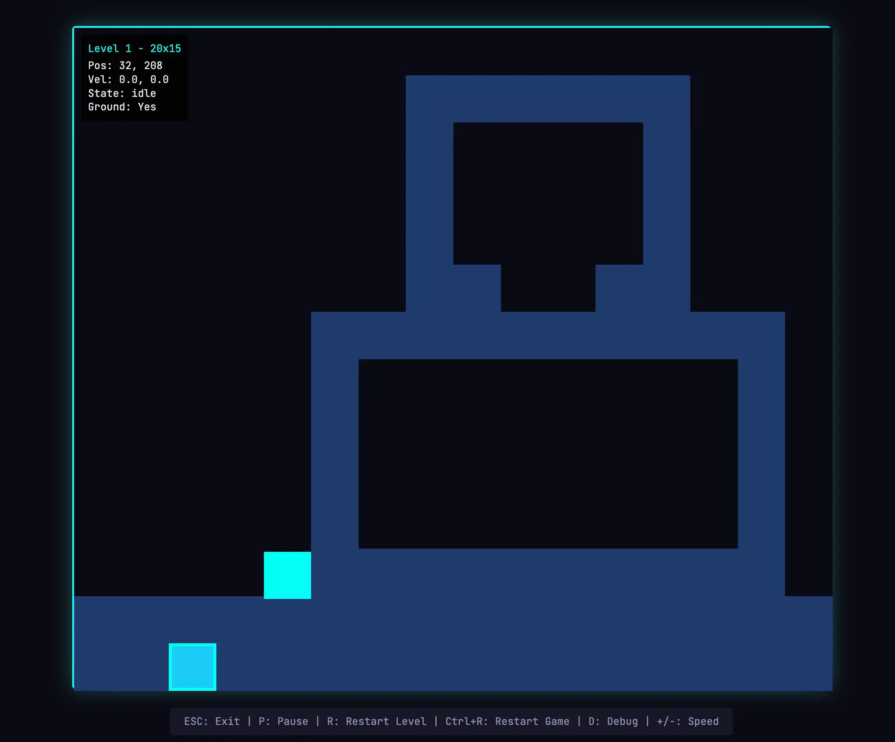

# Harness design for long-running application development
# 长时间运行的应用开发中的 Harness 设计

Published Mar 24, 2026
发布于 2026 年 3 月 24 日

---

Harness design is key to performance at the frontier of agentic coding. Here's how we pushed Claude further in frontend design and long-running autonomous software engineering.

Harness 设计是 Agent 编码前沿性能的关键。本文介绍了我们如何在前端设计和长时间自主软件工程方面进一步推动 Claude 的表现。

---

*Written by Prithvi Rajasekaran, a member of our Labs team.*

*作者：Prithvi Rajasekaran，Anthropic Labs 团队成员。*

---

Over the past several months I've been working on two interconnected problems: getting Claude to produce high-quality frontend designs, and getting it to build complete applications without human intervention. This work originated with earlier efforts on our frontend design skill and long-running coding agent harness, where my colleagues and I were able to improve Claude's performance well above baseline through prompt engineering and harness design—but both eventually hit ceilings.

在过去几个月里，我一直在攻克两个相互关联的问题：让 Claude 产出高质量的前端设计，以及让它在没有人类干预的情况下构建完整的应用程序。这项工作源于我们早期在前端设计技能和长时间运行的编码 Agent Harness 上的探索——我和同事们通过 prompt 工程和 harness 设计将 Claude 的表现提升到了远超基线的水平——但两者最终都触及了天花板。

---

To break through, I sought out novel AI engineering approaches that held across two quite different domains, one defined by subjective taste, the other by verifiable correctness and usability. Taking inspiration from Generative Adversarial Networks (GANs), I designed a multi-agent structure with a **generator** and **evaluator** agent. Building an evaluator that graded outputs reliably—and with taste—meant first developing a set of criteria that could turn subjective judgments like "is this design good?" into concrete, gradable terms.

为了突破这个天花板，我探索了在两个截然不同的领域都能成立的新型 AI 工程方法——一个由主观审美定义，另一个由可验证的正确性和可用性定义。受生成对抗网络（GANs）的启发，我设计了一个包含 **生成器（generator）** 和 **评估器（evaluator）** 的多 Agent 架构。要构建一个能可靠评分——并且有品味地评分——的评估器，首先需要开发一套标准，将"这个设计好不好？"这样的主观判断转化为具体的、可评分的术语。

---

I then applied these techniques to long-running autonomous coding, carrying over two lessons from our earlier harness work: decomposing the build into tractable chunks, and using structured artifacts to hand off context between sessions. The final result was a three-agent architecture—planner, generator, and evaluator—that produced rich full-stack applications over multi-hour autonomous coding sessions.

然后，我将这些技术应用到长时间自主编码中，沿用了早期 harness 工作的两个经验：将构建任务分解为可处理的块，以及使用结构化产物在会话之间传递上下文。最终结果是一个三 Agent 架构——规划器（planner）、生成器（generator）和评估器（evaluator）——能够在数小时的自主编码会话中产出丰富的全栈应用。

---

## Why naive implementations fall short
## 为什么朴素实现不够好

---

We've previously shown that harness design has a substantial impact on the effectiveness of long running agentic coding. In an earlier experiment, we used an initializer agent to decompose a product spec into a task list, and a coding agent that implemented the tasks one feature at a time before handing off artifacts to carry context across sessions. The broader developer community has converged on similar insights, with approaches like the "Ralph Wiggum" method using hooks or scripts to keep agents in continuous iteration cycles.

我们之前已经展示过，harness 设计对长时间运行的 Agent 编码效果有重大影响。在一个更早的实验中，我们使用一个初始化 Agent 将产品规格分解为任务列表，以及一个编码 Agent 逐个特性实现任务，然后交接产物以跨会话传递上下文。更广泛的开发者社区也汇聚到了类似的洞察上，比如"Ralph Wiggum"方法使用 hooks 或脚本来保持 Agent 的持续迭代循环。

---

But some problems remained persistent. For more complex tasks, the agent still tends to go off the rails over time. While decomposing this issue, we observed two common failure modes with agents executing these sorts of tasks.

但一些问题始终存在。对于更复杂的任务，Agent 仍然倾向于随着时间推移而偏离轨道。在分解这个问题时，我们观察到 Agent 执行此类任务的两种常见失败模式。

---

First is that models tend to lose coherence on lengthy tasks as the context window fills (see our post on context engineering). Some models also exhibit "context anxiety," in which they begin wrapping up work prematurely as they approach what they believe is their context limit. Context resets—clearing the context window entirely and starting a fresh agent, combined with a structured handoff that carries the previous agent's state and the next steps—addresses both these issues.

第一种是，随着上下文窗口被填满，模型在冗长任务上往往会失去连贯性（参见我们关于上下文工程的文章）。一些模型还表现出"上下文焦虑"——当它们接近自认为的上下文限制时，会过早地开始收尾工作。上下文重置——完全清除上下文窗口并启动一个全新的 Agent，结合携带前一个 Agent 状态和后续步骤的结构化交接——可以同时解决这两个问题。

---

This differs from compaction, where earlier parts of the conversation are summarized in place so the same agent can keep going on a shortened history. While compaction preserves continuity, it doesn't give the agent a clean slate, which means context anxiety can still persist. A reset provides a clean slate, at the cost of the handoff artifact having enough state for the next agent to pick up the work cleanly. In our earlier testing, we found Claude Sonnet 4.5 exhibited context anxiety strongly enough that compaction alone wasn't sufficient to enable strong long task performance, so context resets became essential to the harness design. This solves the core issue, but adds orchestration complexity, token overhead, and latency to each harness run.

这与压缩（compaction）不同——压缩是就地总结对话的早期部分，让同一个 Agent 在缩短的历史上继续工作。虽然压缩保留了连续性，但它没有给 Agent 一个全新的起点，这意味着上下文焦虑仍可能持续存在。重置提供了一个全新的起点，代价是交接产物需要包含足够的状态以让下一个 Agent 能干净地接手工作。在我们早期的测试中，我们发现 Claude Sonnet 4.5 的上下文焦虑严重到仅靠压缩不足以实现良好的长任务性能，因此上下文重置成为了 harness 设计的关键要素。这解决了核心问题，但给每次 harness 运行增加了编排复杂性、token 开销和延迟。

---

A second issue, which we haven't previously addressed, is self-evaluation. When asked to evaluate work they've produced, agents tend to respond by confidently praising the work—even when, to a human observer, the quality is obviously mediocre. This problem is particularly pronounced for subjective tasks like design, where there is no binary check equivalent to a verifiable software test. Whether a layout feels polished or generic is a judgment call, and agents reliably skew positive when grading their own work.

第二个问题——我们之前没有解决过——是自我评估。当被要求评估自己产出的工作时，Agent 倾向于自信地赞扬这些工作——即使在人类观察者看来，质量明显很一般。这个问题在设计这样的主观任务上尤为突出，因为不存在等同于可验证软件测试的二元检查。一个布局是精致还是平庸属于主观判断，而 Agent 在给自己的工作评分时可靠地偏向正面。

---

However, even on tasks that do have verifiable outcomes, agents still sometimes exhibit poor judgment that impedes their performance while completing the task. Separating the agent doing the work from the agent judging it proves to be a strong lever to address this issue. The separation doesn't immediately eliminate that leniency on its own; the evaluator is still an LLM that is inclined to be generous towards LLM-generated outputs. But tuning a standalone evaluator to be skeptical turns out to be far more tractable than making a generator critical of its own work, and once that external feedback exists, the generator has something concrete to iterate against.

然而，即使在有可验证结果的任务上，Agent 有时仍然表现出阻碍其完成任务的糟糕判断力。将做工作的 Agent 和评判工作的 Agent 分离，被证明是解决这个问题的一个强有力的杠杆。这种分离本身并不会立即消除宽容倾向；评估器仍然是一个倾向于对 LLM 生成输出手下留情的 LLM。但调优一个独立的评估器使其变得挑剔，远比让生成器对自己的工作保持批判性要容易得多，而且一旦有了这种外部反馈，生成器就有了具体的迭代目标。

---

## Frontend design: making subjective quality gradable
## 前端设计：让主观质量变得可评分

---

I started by experimenting on frontend design, where the self-evaluation issue was most visible. Absent any intervention, Claude normally gravitates toward safe, predictable layouts that are technically functional but visually unremarkable.

我从前端设计开始实验，因为自我评估问题在这里最为明显。在没有任何干预的情况下，Claude 通常会趋向于安全的、可预测的布局——技术上可用但视觉上平淡无奇。

---

Two insights shaped the harness I built for frontend design. First, while aesthetics can't be fully reduced to a score—and individual tastes will always vary—they can be improved with grading criteria that encode design principles and preferences. "Is this design beautiful?" is hard to answer consistently, but "does this follow our principles for good design?" gives Claude something concrete to grade against. Second, by separating frontend generation from frontend grading, we can create a feedback loop that drives the generator toward stronger outputs.

两个洞察塑造了我为前端设计构建的 harness。第一，虽然美学不能被完全还原为分数——个人品味总会有差异——但可以通过编码设计原则和偏好的评分标准来提升。"这个设计美吗？"很难一致地回答，但"这遵循了我们的好设计原则吗？"给了 Claude 具体的评分依据。第二，通过将前端生成和前端评分分离，我们可以创建一个驱动生成器产出更强结果的反馈循环。

---

With this in mind, I wrote four grading criteria that I gave to both the generator and evaluator agents in their prompts:

基于此，我编写了四个评分标准，并在 prompt 中同时提供给生成器和评估器 Agent：

---

- **Design quality:** Does the design feel like a coherent whole rather than a collection of parts? Strong work here means the colors, typography, layout, imagery, and other details combine to create a distinct mood and identity.
- **Originality:** Is there evidence of custom decisions, or is this template layouts, library defaults, and AI-generated patterns? A human designer should recognize deliberate creative choices. Unmodified stock components—or telltale signs of AI generation like purple gradients over white cards—fail here.
- **Craft:** Technical execution: typography hierarchy, spacing consistency, color harmony, contrast ratios. This is a competence check rather than a creativity check. Most reasonable implementations do fine here by default; failing means broken fundamentals.
- **Functionality:** Usability independent of aesthetics. Can users understand what the interface does, find primary actions, and complete tasks without guessing?

- **设计质量：** 设计是否给人以连贯整体的感觉，而非零散部件的拼凑？在这方面表现出色意味着颜色、排版、布局、图像和其他细节组合在一起，创造出独特的氛围和身份感。
- **原创性：** 是否有自定义决策的痕迹，还是只是模板布局、库默认值和 AI 生成模式？人类设计师应该能识别出刻意的创意选择。未修改的原始组件——或者 AI 生成的标志性特征，如白色卡片上的紫色渐变——在这里不及格。
- **工艺：** 技术执行力：排版层级、间距一致性、色彩和谐、对比度。这是一个能力检查而非创意检查。大多数合理的实现默认就能做好；不及格意味着基本功有问题。
- **功能性：** 独立于美学的可用性。用户能否理解界面的功能、找到主要操作、不用猜测就能完成任务？

---

I emphasized design quality and originality over craft and functionality. Claude already scored well on craft and functionality by default, as the required technical competence tended to come naturally to the model. But on design and originality, Claude often produced outputs that were bland at best. The criteria explicitly penalized highly generic "AI slop" patterns, and by weighting design and originality more heavily it pushed the model toward more aesthetic risk-taking.

我在设计质量和原创性上的权重高于工艺和功能性。Claude 默认在工艺和功能性上就已经表现不错，因为所需的技术能力往往是模型天然具备的。但在设计和原创性方面，Claude 产出的结果往好了说也只是平淡。评分标准明确惩罚高度通用的"AI 垃圾"模式，通过更重地加权设计和原创性，推动模型在美学上进行更多冒险尝试。

---

I calibrated the evaluator using few-shot examples with detailed score breakdowns. This ensured the evaluator's judgment aligned with my preferences, and reduced score drift across iterations.

我使用带有详细评分细目的少样本示例来校准评估器。这确保了评估器的判断与我的偏好对齐，并减少了跨迭代的评分漂移。

---

I built the loop on the Claude Agent SDK, which kept the orchestration straightforward. A generator agent first created an HTML/CSS/JS frontend based on a user prompt. I gave the evaluator the Playwright MCP, which let it interact with the live page directly before scoring each criterion and writing a detailed critique. In practice, the evaluator would navigate the page on its own, screenshotting and carefully studying the implementation before producing its assessment. That feedback flowed back to the generator as input for the next iteration. I ran 5 to 15 iterations per generation, with each iteration typically pushing the generator in a more distinctive direction as it responded to the evaluator's critique. Because the evaluator was actively navigating the page rather than scoring a static screenshot, each cycle took real wall-clock time. Full runs stretched up to four hours. I also instructed the generator to make a strategic decision after each evaluation: refine the current direction if scores were trending well, or pivot to an entirely different aesthetic if the approach wasn't working.

我在 Claude Agent SDK 上构建了这个循环，使编排保持简洁。生成器 Agent 首先根据用户 prompt 创建一个 HTML/CSS/JS 前端。我给评估器配备了 Playwright MCP，让它在评分每个标准和撰写详细评语之前能直接与实时页面交互。在实践中，评估器会自主浏览页面，截图并仔细研究实现，然后再产出评估。该反馈作为下一轮迭代的输入回流给生成器。我每次生成运行 5 到 15 轮迭代，每轮迭代通常会在评估器评语的推动下将生成器推向更有特色的方向。因为评估器在主动浏览页面而非评分静态截图，每个周期需要实际的时间消耗。完整运行最长可达四小时。我还指示生成器在每次评估后做出战略决策：如果分数趋势良好就精化当前方向，如果方法行不通就转向一个完全不同的美学方向。

---

Across runs, the evaluator's assessments improved over iterations before plateauing, with headroom still remaining. Some generations refined incrementally. Others took sharp aesthetic turns between iterations.

在多次运行中，评估器的评分随迭代提升后趋于平稳，但仍有提升空间。一些生成是渐进式精化的。另一些则在迭代之间发生了剧烈的美学转向。

---

The wording of the criteria steered the generator in ways I didn't fully anticipate. Including phrases like "the best designs are museum quality" pushed designs toward a particular visual convergence, suggesting that the prompting associated with the criteria directly shaped the character of the output.

标准的措辞以我没有完全预料到的方式引导了生成器。包含"最好的设计是博物馆级品质"这样的短语将设计推向了特定的视觉趋同，这表明与标准相关联的 prompt 直接塑造了输出的特征。

---

While scores generally improved over iterations, the pattern was not always cleanly linear. Later implementations tended to be better as a whole, but I regularly saw cases where I preferred a middle iteration over the last one. Implementation complexity also tended to increase across rounds, with the generator reaching for more ambitious solutions in response to the evaluator's feedback. Even on the first iteration, outputs were noticeably better than a baseline with no prompting at all, suggesting the criteria and associated language themselves steered the model away from generic defaults before any evaluator feedback led to further refinement.

虽然分数总体上随迭代提升，但模式并不总是完美的线性。后期的实现整体上倾向于更好，但我经常看到自己更喜欢中间某次迭代而非最后一次的情况。实现复杂度也倾向于在各轮之间增加，生成器在评估器反馈的推动下寻求更有雄心的解决方案。即使在第一次迭代中，输出也明显好于完全没有 prompt 的基线，这表明标准及其相关语言本身就在任何评估器反馈导致进一步精化之前，就已经将模型引导远离了通用默认值。

---

In one notable example, I prompted the model to create a website for a Dutch art museum. By the ninth iteration, it had produced a clean, dark-themed landing page for a fictional museum. The page was visually polished but largely in line with my expectations. Then, on the tenth cycle, it scrapped the approach entirely and reimagined the site as a spatial experience: a 3D room with a checkered floor rendered in CSS perspective, artwork hung on the walls in free-form positions, and doorway-based navigation between gallery rooms instead of scroll or click. It was the kind of creative leap that I hadn't seen before from a single-pass generation.

在一个值得注意的例子中，我让模型创建一个荷兰美术馆的网站。到第九次迭代时，它产出了一个干净的、深色主题的虚构博物馆着陆页。页面视觉上很精致，但基本在我的预期之内。然后，在第十个周期，它完全推翻了这个方案，将网站重新构想为一种空间体验：一个用 CSS 透视渲染的棋盘格地板的 3D 房间，画作以自由形式挂在墙上，画廊房间之间通过门道式导航而非滚动或点击来切换。这是我之前从未在单次生成中见过的那种创造性飞跃。

---

https://github.com/user-attachments/assets/c7dca629-171b-4bf9-9cd9-d4ed9f233d09

*荷兰美术馆网站的 3D 空间体验迭代演示 | [▶ 在线观看原文](https://www.anthropic.com/engineering/harness-design-long-running-apps)*

---

## Scaling to full-stack coding
## 扩展到全栈编码

---

With these findings in hand, I applied this GAN-inspired pattern to full-stack development. The generator-evaluator loop maps naturally onto the software development lifecycle, where code review and QA serve the same structural role as the design evaluator.

带着这些发现，我将这种受 GAN 启发的模式应用到了全栈开发中。生成器-评估器循环自然地映射到软件开发生命周期上，其中代码评审和 QA 与设计评估器扮演着相同的结构性角色。

---

### The architecture
### 架构

---

In our earlier long-running harness, we had solved for coherent multi-session coding with an initializer agent, a coding agent that worked one feature at a time, and context resets between sessions. Context resets were a key unlock: the harness used Sonnet 4.5, which exhibited the "context anxiety" tendency mentioned earlier. Creating a harness that worked well across context resets was key to keeping the model on task. Opus 4.5 largely removed that behavior on its own, so I was able to drop context resets from this harness entirely. The agents were run as one continuous session across the whole build, with the Claude Agent SDK's automatic compaction handling context growth along the way.

在我们早期的长时间运行 harness 中，我们通过初始化 Agent、逐特性工作的编码 Agent 和会话间的上下文重置来解决连贯的多会话编码问题。上下文重置是关键突破：当时的 harness 使用 Sonnet 4.5，它表现出前面提到的"上下文焦虑"倾向。创建一个能在上下文重置间良好工作的 harness 是保持模型专注任务的关键。Opus 4.5 基本上自行消除了这种行为，因此我能够从这个 harness 中完全去掉上下文重置。各 Agent 作为一个连续会话跨整个构建过程运行，由 Claude Agent SDK 的自动压缩来处理上下文增长。

---

For this work I built on the foundation from the original harness with a three-agent system, with each agent addressing a specific gap I'd observed in prior runs. The system contained the following agent personas:

在这项工作中，我在原始 harness 的基础上构建了一个三 Agent 系统，每个 Agent 解决我在之前运行中观察到的特定不足。系统包含以下 Agent 角色：

---

**Planner:** Our previous long-running harness required the user to provide a detailed spec upfront. I wanted to automate that step, so I created a planner agent that took a simple 1-4 sentence prompt and expanded it into a full product spec. I prompted it to be ambitious about scope and to stay focused on product context and high level technical design rather than detailed technical implementation. This emphasis was due to the concern that if the planner tried to specify granular technical details upfront and got something wrong, the errors in the spec would cascade into the downstream implementation. It seemed smarter to constrain the agents on the deliverables to be produced and let them figure out the path as they worked. I also asked the planner to find opportunities to weave AI features into the product specs.

**规划器：** 我们之前的长时间运行 harness 要求用户预先提供详细的规格说明。我想自动化这一步，所以创建了一个规划器 Agent，它接受简单的 1-4 句 prompt 并将其扩展为完整的产品规格。我在 prompt 中要求它在范围上保持雄心，并专注于产品上下文和高层技术设计，而非详细的技术实现。这样做的考量是：如果规划器试图在前期就指定细粒度的技术细节并出了错，规格中的错误会级联到下游实现中。将 Agent 约束在要交付的成果上，让它们在工作过程中自行找到路径，似乎更聪明。我还要求规划器寻找机会将 AI 功能融入产品规格中。

---

**Generator:** The one-feature-at-a-time approach from the earlier harness worked well for scope management. I applied a similar model here, instructing the generator to work in sprints, picking up one feature at a time from the spec. Each sprint implemented the app with a React, Vite, FastAPI, and SQLite (later PostgreSQL) stack, and the generator was instructed to self-evaluate its work at the end of each sprint before handing off to QA. It also had git for version control.

**生成器：** 早期 harness 的逐特性方法在范围管理上效果很好。我在这里应用了类似的模型，指示生成器按 sprint 工作，每次从规格中选取一个特性。每个 sprint 使用 React、Vite、FastAPI 和 SQLite（后来换为 PostgreSQL）技术栈来实现应用，生成器被指示在每个 sprint 结束时进行自我评估，然后交接给 QA。它还有 git 用于版本控制。

---

**Evaluator:** Applications from earlier harnesses often looked impressive but still had real bugs when you actually tried to use them. To catch these, the evaluator used the Playwright MCP to click through the running application the way a user would, testing UI features, API endpoints, and database states. It then graded each sprint against both the bugs it had found and a set of criteria modeled on the frontend experiment, adapted here to cover product depth, functionality, visual design, and code quality. Each criterion had a hard threshold, and if any one fell below it, the sprint failed and the generator got detailed feedback on what went wrong.

**评估器：** 早期 harness 产出的应用往往看起来很惊艳，但当你真正去用时仍然有真实的 bug。为了捕捉这些问题，评估器使用 Playwright MCP 像用户一样点击浏览运行中的应用，测试 UI 功能、API 端点和数据库状态。然后它根据发现的 bug 和一套从前端实验改编而来的标准对每个 sprint 进行评分，这里的标准覆盖了产品深度、功能性、视觉设计和代码质量。每个标准有一个硬性阈值，如果任何一个低于阈值，sprint 就失败，生成器会收到关于问题所在的详细反馈。

---

Before each sprint, the generator and evaluator negotiated a sprint contract: agreeing on what "done" looked like for that chunk of work before any code was written. This existed because the product spec was intentionally high-level, and I wanted a step to bridge the gap between user stories and testable implementation. The generator proposed what it would build and how success would be verified, and the evaluator reviewed that proposal to make sure the generator was building the right thing. The two iterated until they agreed.

在每个 sprint 之前，生成器和评估器会协商一个 sprint 合同：在写任何代码之前就该块工作的"完成"标准达成一致。之所以有这一步，是因为产品规格是有意保持高层级的，我需要一个步骤来弥合用户故事和可测试实现之间的差距。生成器提出它将构建什么以及如何验证成功，评估器审查该提案以确保生成器在做正确的事情。两者反复迭代直到达成一致。

---

Communication was handled via files: one agent would write a file, another agent would read it and respond either within that file or with a new file that the previous agent would read in turn. The generator then built against the agreed-upon contract before handing the work off to QA. This kept the work faithful to the spec without over-specifying implementation too early.

通信通过文件进行：一个 Agent 写文件，另一个 Agent 读取并在该文件内或通过新文件回复，前一个 Agent 再依次读取。然后生成器按照商定的合同进行构建，再将工作交接给 QA。这使得工作忠于规格，同时不会过早地过度指定实现细节。

---

### Running the harness
### 运行 Harness

---

For the first version of this harness, I used Claude Opus 4.5, running user prompts against both the full harness and a single-agent system for comparison. I used Opus 4.5 since this was our best coding model when I began these experiments.

对于这个 harness 的第一个版本，我使用了 Claude Opus 4.5，将用户 prompt 同时在完整 harness 和单 Agent 系统上运行以进行比较。我选择 Opus 4.5 是因为这是我开始这些实验时我们最好的编码模型。

---

I wrote the following prompt to generate a retro video game maker:

我写了以下 prompt 来生成一个复古电子游戏制作器：

> *Create a 2D retro game maker with features including a level editor, sprite editor, entity behaviors, and a playable test mode.*

> *创建一个 2D 复古游戏制作器，功能包括关卡编辑器、精灵编辑器、实体行为和可玩的测试模式。*

---

| **Harness** | **Duration 时长** | **Cost 成本** |
| --- | --- | --- |
| Solo 单 Agent | 20 min | $9 |
| Full harness 完整 Harness | 6 hr | $200 |

---

The harness was over 20x more expensive, but the difference in output quality was immediately apparent.

Harness 的成本超过 20 倍，但输出质量的差异立即显而易见。

---

I was expecting an interface where I could construct a level and its component parts (sprites, entities, tile layout) then hit play to actually play the level. I started by opening the solo run's output, and the initial application seemed in line with those expectations.

我期望的是一个可以构建关卡及其组成部分（精灵、实体、瓦片布局）然后按下播放键来实际玩关卡的界面。我首先打开了单 Agent 运行的输出，初始应用似乎符合这些期望。

---

As I clicked through, however, issues started to emerge. The layout wasted space, with fixed-height panels leaving most of the viewport empty. The workflow was rigid. Trying to populate a level prompted me to create sprites and entities first, but nothing in the UI guided me toward that sequence. More to the point, the actual game was broken. My entities appeared on screen but nothing responded to input. Digging into the code revealed that the wiring between entity definitions and the game runtime was broken, with no surface indication of where.

然而，当我点击浏览时，问题开始显现。布局浪费空间，固定高度的面板让大部分视口空白。工作流很僵硬。尝试填充关卡时提示我先创建精灵和实体，但 UI 中没有任何东西引导我按这个顺序操作。更关键的是，实际的游戏是坏的。我的实体出现在屏幕上，但没有任何东西响应输入。深入代码后发现，实体定义和游戏运行时之间的接线断了，而且表面上看不出问题在哪里。

---

**Solo harness outputs / 单 Agent 输出：**


*Opening screen / 打开应用时的初始界面（单 Agent 生成）*


*Sprite editor / 在单 Agent 生成的精灵编辑器中创建精灵*


*Game play / 尝试（未能成功）玩我创建的关卡*

---

After evaluating the solo run, I turned my attention to the harness run. This run started from the same one-sentence prompt, but the planner step expanded that prompt into a 16-feature spec spread across ten sprints. It went well beyond what the solo run attempted. In addition to the core editors and play mode, the spec called for a sprite animation system, behavior templates, sound effects and music, an AI-assisted sprite generator and level designer, and game export with shareable links. I gave the planner access to our frontend design skill, which it read and used to create a visual design language for the app as part of the spec. For each sprint, the generator and evaluator negotiated a contract defining the specific implementation details for the sprint, and the testable behaviors that would be tested to verify completion.

评估完单 Agent 运行后，我转向 harness 运行。这次运行从相同的单句 prompt 开始，但规划器步骤将该 prompt 扩展为分布在十个 sprint 中的 16 个特性规格。它远远超出了单 Agent 运行所尝试的范围。除了核心编辑器和游戏模式外，规格还包括精灵动画系统、行为模板、音效和音乐、AI 辅助的精灵生成器和关卡设计器，以及带有可分享链接的游戏导出功能。我给规划器提供了我们的前端设计技能，它读取并用它为应用创建了一套视觉设计语言作为规格的一部分。对于每个 sprint，生成器和评估器协商了一个合同，定义了该 sprint 的具体实现细节和用于验证完成的可测试行为。

---

The app immediately showed more polish and smoothness than the solo run. The canvas used the full viewport, the panels were sized sensibly, and the interface had a consistent visual identity that tracked the design direction from the spec. Some of the clunkiness I'd seen in the solo run did remain—the workflow still didn't make it clear that you should build sprites and entities before trying to populate a level, and I had to figure that out by poking around. This read as a gap in the base model's product intuition rather than something the harness was designed to address, though it did suggest a place where targeted iteration inside the harness could help to further improve output quality.

应用立即展现出比单 Agent 运行更多的精致和流畅。画布使用了整个视口，面板大小合理，界面有一致的视觉识别，追踪了规格中的设计方向。我在单 Agent 运行中看到的一些笨拙之处确实仍然存在——工作流仍然没有明确表明你应该先创建精灵和实体再填充关卡，我不得不自己摸索。这读起来更像是基础模型产品直觉的不足，而非 harness 本身要解决的问题，不过它确实暗示了一个可以通过 harness 内的针对性迭代来进一步提升输出质量的方向。

---

**Full harness outputs / 完整 Harness 输出：**


*Opening screen / 初始界面：在完整 harness 构建的应用中创建新游戏*


*Sprite editor / 精灵编辑器感觉更干净、更易用*


*AI game design / 使用内置 AI 功能生成关卡*


*AI game design / 使用内置 AI 功能生成关卡（续）*


*Game play / 游玩我生成的游戏*

---

The biggest difference was in play mode. I was actually able to move my entity and play the game. The physics had some rough edges—my character jumped onto a platform but ended up overlapping with it, which felt intuitively wrong—but the core thing worked, which the solo run did not manage. After moving around a bit, I did hit some limitations with the AI's game level construction. There was a large wall that I wasn't able to jump past, so I was stuck. This suggested there were some common sense improvements and edge cases that the harness could handle to further refine the app.

最大的差异体现在游戏模式上。我实际上能够移动我的实体并玩游戏。物理引擎有些粗糙——我的角色跳上平台后与之重叠了，这在直觉上感觉不对——但核心功能是可用的，而单 Agent 运行没能做到这一点。移动了一会儿后，我确实遇到了 AI 关卡构建的一些限制。有一面大墙我无法跳过去，所以我被卡住了。这表明还有一些常识性改进和边缘情况可以通过 harness 来进一步完善应用。

---

Reading through the logs, it was clear that the evaluator kept the implementation in line with the spec. Each sprint, it walked through the sprint contract's test criteria and exercised the running application through Playwright, filing bugs against anything that diverged from expected behavior. The contracts were granular—Sprint 3 alone had 27 criteria covering the level editor—and the evaluator's findings were specific enough to act on without extra investigation. The table below shows several examples of issues our evaluator identified:

阅读日志后可以清楚地看到，评估器使实现保持与规格一致。每个 sprint，它遍历 sprint 合同的测试标准，通过 Playwright 操作运行中的应用，对任何偏离预期行为的问题提交 bug。合同非常细粒度——仅 Sprint 3 就有 27 个覆盖关卡编辑器的标准——评估器的发现足够具体，无需额外调查即可采取行动。下表展示了评估器发现的几个问题示例：

---

| **Contract criterion 合同标准** | **Evaluator finding 评估器发现** |
| --- | --- |
| Rectangle fill tool allows click-drag to fill a rectangular area with selected tile / 矩形填充工具允许点击拖拽用选定瓦片填充矩形区域 | **FAIL** — Tool only places tiles at drag start/end points instead of filling the region. `fillRectangle` function exists but isn't triggered properly on mouseUp. / **失败** — 工具仅在拖拽起止点放置瓦片，而非填充整个区域。`fillRectangle` 函数存在但在 mouseUp 时未被正确触发。 |
| User can select and delete placed entity spawn points / 用户可以选择并删除已放置的实体生成点 | **FAIL** — Delete key handler at `LevelEditor.tsx:892` requires both `selection` and `selectedEntityId` to be set, but clicking an entity only sets `selectedEntityId`. / **失败** — `LevelEditor.tsx:892` 处的删除键处理需要同时设置 `selection` 和 `selectedEntityId`，但点击实体只设置了 `selectedEntityId`。 |
| User can reorder animation frames via API / 用户可以通过 API 重新排序动画帧 | **FAIL** — `PUT /frames/reorder` route defined after `/{frame_id}` routes. FastAPI matches '`reorder`' as a frame_id integer and returns 422. / **失败** — `PUT /frames/reorder` 路由定义在 `/{frame_id}` 路由之后。FastAPI 将 '`reorder`' 匹配为 frame_id 整数并返回 422。 |

---

Getting the evaluator to perform at this level took work. Out of the box, Claude is a poor QA agent. In early runs, I watched it identify legitimate issues, then talk itself into deciding they weren't a big deal and approve the work anyway. It also tended to test superficially, rather than probing edge cases, so more subtle bugs often slipped through. The tuning loop was to read the evaluator's logs, find examples where its judgment diverged from mine, and update the QA's prompt to solve for those issues. It took several rounds of this development loop before the evaluator was grading in a way that I found reasonable. Even then, the harness output showed the limits of the model's QA capabilities: small layout issues, interactions that felt unintuitive in places, and undiscovered bugs in more deeply nested features that the evaluator hadn't exercised thoroughly. There was clearly more verification headroom to capture with further tuning. But compared to the solo run, where the central feature of the application simply didn't work, the lift was obvious.

让评估器达到这个水平需要付出努力。开箱即用的 Claude 是一个糟糕的 QA Agent。在早期运行中，我看着它识别出合理的问题，然后自我说服这些问题不是什么大事，最终还是批准了工作。它还倾向于进行浅层测试，而不是深入探查边缘情况，因此更微妙的 bug 经常漏过。调优循环是阅读评估器的日志，找到它的判断与我的判断不一致的例子，然后更新 QA 的 prompt 来解决这些问题。经过好几轮这样的开发循环，评估器的评分才达到我认为合理的程度。即便如此，harness 的输出仍然显示了模型 QA 能力的局限：小的布局问题、某些地方感觉不直观的交互，以及评估器没有充分测试的更深层嵌套功能中未被发现的 bug。通过进一步调优显然还有更多验证空间可以挖掘。但与单 Agent 运行相比——那里应用的核心功能根本无法工作——提升是显而易见的。

---

### Iterating on the harness
### 迭代 Harness

---

The first set of harness results was encouraging, but it was also bulky, slow, and expensive. The logical next step was to find ways to simplify the harness without degrading its performance. This was partly common sense and partly a function of a more general principle: every component in a harness encodes an assumption about what the model can't do on its own, and those assumptions are worth stress testing, both because they may be incorrect, and because they can quickly go stale as models improve. Our blog post Building Effective Agents frames the underlying idea as "find the simplest solution possible, and only increase complexity when needed," and it's a pattern that shows up consistently for anyone maintaining an agent harness.

第一组 harness 结果令人鼓舞，但它也笨重、缓慢且昂贵。合乎逻辑的下一步是寻找在不降低性能的情况下简化 harness 的方法。这部分是常识，部分是一个更一般性原则的体现：harness 中的每个组件都编码了一个关于模型自身无法做什么的假设，而这些假设值得进行压力测试——因为它们可能是不正确的，也因为随着模型的改进，它们可能很快就过时了。我们的博客文章《构建有效的 Agent》将底层理念概括为"找到尽可能简单的解决方案，只在需要时才增加复杂性"，这是维护 Agent harness 的人都会持续遇到的模式。

---

In my first attempt to simplify, I cut the harness back radically and tried a few creative new ideas, but I wasn't able to replicate the performance of the original. It also became difficult to tell which pieces of the harness design were actually load-bearing, and in what ways. Based on that experience, I moved to a more methodical approach, removing one component at a time and reviewing what impact it had on the final result.

在我第一次尝试简化时，我大幅削减了 harness 并尝试了一些创造性的新想法，但无法复制原始版本的性能。也变得很难分辨 harness 设计中哪些部分实际上是承重的，以及以何种方式承重。基于这个经验，我转向了更有条理的方法，一次移除一个组件，审查它对最终结果的影响。

---

As I was going through these iteration cycles, we also released Opus 4.6, which provided further motivation to reduce harness complexity. There was good reason to expect 4.6 would need less scaffolding than 4.5 did. From our launch blog: "[Opus 4.6] plans more carefully, sustains agentic tasks for longer, can operate more reliably in larger codebases, and has better code review and debugging skills to catch its own mistakes." It also improved substantially on long-context retrieval. These were all capabilities the harness had been built to supplement.

在我进行这些迭代周期时，我们还发布了 Opus 4.6，这进一步促使我们减少 harness 的复杂性。有充分的理由预期 4.6 需要比 4.5 更少的脚手架。从我们的发布博客引用："[Opus 4.6] 规划更谨慎，能更持久地维持 Agent 任务，能更可靠地在大型代码库中工作，并且有更好的代码审查和调试技能来捕获自己的错误。"它在长上下文检索方面也有了实质性改进。这些都是 harness 原本为之补充的能力。

---

### Removing the sprint construct
### 移除 Sprint 结构

---

I started by removing the sprint construct entirely. The sprint structure had helped to decompose work into chunks for the model to work coherently. Given the improvements in Opus 4.6, there was good reason to believe that the model could natively handle the job without this sort of decomposition.

我首先完全移除了 sprint 结构。Sprint 结构此前帮助将工作分解为块以让模型连贯地工作。鉴于 Opus 4.6 的改进，有充分的理由相信模型可以在没有这种分解的情况下原生处理工作。

---

I kept both the planner and evaluator, as each continued to add obvious value. Without the planner, the generator under-scoped: given the raw prompt, it would start building without first speccing its work, and end up creating a less feature-rich application than the planner did.

我保留了规划器和评估器，因为两者都持续提供明显的价值。没有规划器，生成器的范围会不足：给定原始 prompt，它会在没有先制定规格的情况下开始构建，最终创建出比规划器所规划的功能更少的应用。

---

With the sprint construct removed, I moved the evaluator to a single pass at the end of the run rather than grading per sprint. Since the model was much more capable, it changed how load-bearing the evaluator was for certain runs, with its usefulness depending on where the task sat relative to what the model could do reliably on its own. On 4.5, that boundary was close: our builds were at the edge of what the generator could do well solo, and the evaluator caught meaningful issues across the build. On 4.6, the model's raw capability increased, so the boundary moved outward. Tasks that used to need the evaluator's check to be implemented coherently were now often within what the generator handled well on its own, and for tasks within that boundary, the evaluator became unnecessary overhead. But for the parts of the build that were still at the edge of the generator's capabilities, the evaluator continued to give real lift.

移除了 sprint 结构后，我将评估器改为在运行结束时做一次性评估，而不是每个 sprint 评分。由于模型能力大幅提升，这改变了评估器对不同运行的承重程度——它的有用性取决于任务相对于模型自身能可靠完成的范围处于什么位置。在 4.5 上，这个边界很近：我们的构建处于生成器单独能做好的极限，评估器在整个构建中捕捉到了有意义的问题。在 4.6 上，模型的原始能力提升了，所以边界向外移动。过去需要评估器检查才能连贯实现的任务，现在往往在生成器自己能处理好的范围内，对于这些边界内的任务，评估器成了不必要的开销。但对于仍处于生成器能力边缘的构建部分，评估器继续提供真实的提升。

---

The practical implication is that the evaluator is not a fixed yes-or-no decision. It is worth the cost when the task sits beyond what the current model does reliably solo.

实际意义是：评估器不是一个固定的要或不要的决定。当任务超出当前模型单独可靠完成的范围时，它的成本是值得的。

---

Alongside the structural simplification, I also added prompting to improve how the harness built AI features into each app, specifically getting the generator to build a proper agent that could drive the app's own functionality through tools. That took real iteration, since the relevant knowledge is recent enough that Claude's training data covers it thinly. But with enough tuning, the generator was building agents correctly.

在结构简化的同时，我还增加了 prompt 来改善 harness 如何在每个应用中构建 AI 功能——特别是让生成器构建一个能通过工具驱动应用自身功能的 Agent。这需要真正的迭代，因为相关知识足够新，Claude 的训练数据覆盖较薄。但经过足够的调优，生成器能够正确地构建 Agent。

---

### Results from the updated harness
### 更新后 Harness 的结果

---

To put the updated harness to the test, I used the following prompt to generate a Digital Audio Workstation (DAW), a music production program for composing, recording, and mixing songs:

为了测试更新后的 harness，我使用以下 prompt 来生成一个数字音频工作站（DAW）——一个用于作曲、录音和混音的音乐制作程序：

> *Build a fully featured DAW in the browser using the Web Audio API.*

> *使用 Web Audio API 在浏览器中构建一个功能齐全的 DAW。*

---

The run was still lengthy and expensive, at about 4 hours and $124 in token costs.

运行仍然冗长且昂贵——大约 4 小时，token 成本 124 美元。

---

Most of the time went to the builder, which ran coherently for over two hours without the sprint decomposition that Opus 4.5 had needed.

大部分时间花在了构建器上，它在没有 Opus 4.5 所需的 sprint 分解的情况下连贯地运行了超过两个小时。

---

| **Agent & Phase / Agent 与阶段** | **Duration / 时长** | **Cost / 成本** |
| --- | --- | --- |
| Planner / 规划器 | 4.7 min | $0.46 |
| Build (Round 1) / 构建（第 1 轮） | 2 hr 7 min | $71.08 |
| QA (Round 1) / QA（第 1 轮） | 8.8 min | $3.24 |
| Build (Round 2) / 构建（第 2 轮） | 1 hr 2 min | $36.89 |
| QA (Round 2) / QA（第 2 轮） | 6.8 min | $3.09 |
| Build (Round 3) / 构建（第 3 轮） | 10.9 min | $5.88 |
| QA (Round 3) / QA（第 3 轮） | 9.6 min | $4.06 |
| **Total V2 Harness / V2 Harness 总计** | **3 hr 50 min** | **$124.70** |

---

As with the previous harness, the planner expanded the one-line prompt into a full spec. From the logs, I could see the generator model did a good job planning the app and the agent design, wiring the agent up, and testing it before handing off to QA.

与之前的 harness 一样，规划器将单行 prompt 扩展为完整规格。从日志中可以看到，生成器模型在规划应用和 Agent 设计、连接 Agent 以及在交接给 QA 之前测试方面都做得很好。

---

That being said, the QA agent still caught real gaps. In its first-round feedback, it noted:

话虽如此，QA Agent 仍然捕捉到了真实的差距。在第一轮反馈中，它指出：

> This is a strong app with excellent design fidelity, solid AI agent, and good backend. The main failure point is Feature Completeness — while the app looks impressive and the AI integration works well, several core DAW features are display-only without interactive depth: clips can't be dragged/moved on the timeline, there are no instrument UI panels (synth knobs, drum pads), and no visual effect editors (EQ curves, compressor meters). These aren't edge cases — they're the core interactions that make a DAW usable, and the spec explicitly calls for them.

> 这是一个设计保真度优秀、AI Agent 可靠、后端良好的强应用。主要的失败点在于功能完整性——虽然应用看起来令人印象深刻且 AI 集成工作良好，但几个核心 DAW 功能仅是展示性的，缺乏交互深度：片段无法在时间线上拖拽/移动，没有乐器 UI 面板（合成器旋钮、鼓垫），也没有可视化的效果编辑器（EQ 曲线、压缩器仪表）。这些不是边缘情况——它们是使 DAW 可用的核心交互，规格明确要求了它们。

---

In its second round feedback, it again caught several functionality gaps:

在第二轮反馈中，它再次捕捉到了几个功能差距：

> Remaining gaps:
> - Audio recording is still stub-only (button toggles but no mic capture)
> - Clip resize by edge drag and clip split not implemented
> - Effect visualizations are numeric sliders, not graphical (no EQ curve)

> 剩余差距：
> - 音频录制仍然只是存根（按钮可切换但无麦克风捕获）
> - 通过边缘拖拽调整片段大小和片段分割未实现
> - 效果可视化是数字滑块，而非图形化（无 EQ 曲线）

---

The generator was still liable to miss details or stub features when left to its own devices, and the QA still added value in catching those last mile issues for the generator to fix.

当生成器独自工作时仍然容易遗漏细节或留下功能存根，QA 在捕捉这些最后一公里问题以供生成器修复方面仍然有价值。

---

https://github.com/user-attachments/assets/16718c75-2fcd-4fb1-86ea-f54117dfc476

*DAW（数字音频工作站）演示：编曲视图、混音器和通过 AI Agent 进行歌曲创作 | [▶ 在线观看原文](https://www.anthropic.com/engineering/harness-design-long-running-apps)*

---

The app is far from a professional music production program, and the agent's song composition skills could clearly use a lot of work. Additionally, Claude can't actually hear, which made the QA feedback loop less effective with respect to musical taste.

这个应用离专业的音乐制作程序还差很远，Agent 的歌曲创作技能显然还需要大量改进。此外，Claude 实际上无法听声音，这使得 QA 反馈循环在音乐品味方面的有效性降低。

---

But the final app had all the core pieces of a functional music production program: a working arrangement view, mixer, and transport running in the browser. Beyond that, I was able to put together a short song snippet entirely through prompting: the agent set the tempo and key, laid down a melody, built a drum track, adjusted mixer levels, and added reverb. The core primitives for song composition were present, and the agent could drive them autonomously, using tools to create a simple production from end to end. You might say it's not pitch-perfect yet—but it's getting there.

但最终的应用具备了一个功能性音乐制作程序的所有核心要素：在浏览器中运行的编曲视图、混音器和传输控制。除此之外，我能够完全通过 prompt 拼凑出一段简短的歌曲片段：Agent 设置了速度和调性，铺设了旋律，构建了鼓轨，调整了混音器电平，并添加了混响。歌曲创作的核心原语都已就位，Agent 可以自主驱动它们，使用工具从头到尾创建一个简单的制作。你可能会说它还不够完美——但正在接近。

---

## What comes next
## 接下来会怎样

---

As models continue to improve, we can roughly expect them to be capable of working for longer, and on more complex tasks. In some cases, that will mean the scaffold surrounding the model matters less over time, and developers can wait for the next model and see certain problems solve themselves. On the other hand, the better the models get, the more space there is to develop harnesses that can achieve complex tasks beyond what the model can do at baseline.

随着模型持续改进，我们大致可以预期它们能够工作更长时间，处理更复杂的任务。在某些情况下，这意味着围绕模型的脚手架随时间推移变得不那么重要，开发者可以等待下一个模型，看到某些问题自行解决。另一方面，模型越好，就有越多的空间来开发能够完成超越模型基线能力的复杂任务的 harness。

---

With this in mind, there are a few lessons from this work worth carrying forward. It is always good practice to experiment with the model you're building against, read its traces on realistic problems, and tune its performance to achieve your desired outcomes. When working on more complex tasks, there is sometimes headroom from decomposing the task and applying specialized agents to each aspect of the problem. And when a new model lands, it is generally good practice to re-examine a harness, stripping away pieces that are no longer load-bearing to performance and adding new pieces to achieve greater capability that may not have been possible before.

考虑到这一点，这项工作中有几个经验值得铭记。与你正在使用的模型进行实验、阅读它在真实问题上的执行日志、调优其性能以达到你期望的结果，始终是好的实践。在处理更复杂的任务时，有时可以通过分解任务并将专门的 Agent 应用于问题的各个方面来获得提升空间。而当新模型发布时，重新审视 harness 通常是好的实践——剥离不再对性能承重的部分，添加新的部分以实现之前可能无法达到的更强能力。

---

From this work, my conviction is that the space of interesting harness combinations doesn't shrink as models improve. Instead, it moves, and the interesting work for AI engineers is to keep finding the next novel combination.

从这项工作中，我的信念是：有趣的 harness 组合的空间不会随着模型改进而缩小。相反，它在移动，而 AI 工程师的有趣工作就是不断找到下一个新颖的组合。

---

## Acknowledgements
## 致谢

---

Special thanks to Mike Krieger, Michael Agaby, Justin Young, Jeremy Hadfield, David Hershey, Julius Tarng, Xiaoyi Zhang, Barry Zhang, Orowa Sidker, Michael Tingley, Ibrahim Madha, Martina Long, and Canyon Robbins for their contributions to this work.

特别感谢 Mike Krieger、Michael Agaby、Justin Young、Jeremy Hadfield、David Hershey、Julius Tarng、Xiaoyi Zhang、Barry Zhang、Orowa Sidker、Michael Tingley、Ibrahim Madha、Martina Long 和 Canyon Robbins 对这项工作的贡献。

---

Thanks also to Jake Eaton, Alyssa Leonard, and Stef Sequeira for their help shaping the post.

同时感谢 Jake Eaton、Alyssa Leonard 和 Stef Sequeira 对文章撰写的帮助。

---

*Original: https://www.anthropic.com/engineering/harness-design-long-running-apps*
*原文链接：https://www.anthropic.com/engineering/harness-design-long-running-apps*

---

## Appendix
## 附录

---

Example plan generated by planner agent.

规划器 Agent 生成的示例计划。

```
RetroForge - 2D Retro Game Maker

Overview
RetroForge is a web-based creative studio for designing and building 2D
retro-style video games. It combines the nostalgic charm of classic 8-bit
and 16-bit game aesthetics with modern, intuitive editing tools—enabling
anyone from hobbyist creators to indie developers to bring their game
ideas to life without writing traditional code.

The platform provides four integrated creative modules: a tile-based
Level Editor for designing game worlds, a pixel-art Sprite Editor for
crafting visual assets, a visual Entity Behavior system for defining
game logic, and an instant Playable Test Mode for real-time gameplay
testing. By weaving AI assistance throughout (powered by Claude),
RetroForge accelerates the creative process—helping users generate
sprites, design levels, and configure behaviors through natural
language interaction.

RetroForge targets creators who love retro gaming aesthetics but want
modern conveniences. Whether recreating the platformers, RPGs, or action
games of their childhood, or inventing entirely new experiences within
retro constraints, users can prototype rapidly, iterate visually, and
share their creations with others.

Features

1. Project Dashboard & Management

The Project Dashboard is the home base for all creative work in
RetroForge. Users need a clear, organized way to manage their game
projects—creating new ones, returning to works-in-progress, and
understanding what each project contains at a glance.

User Stories: As a user, I want to:

- Create a new game project with a name and description, so that I can
  begin designing my game
- See all my existing projects displayed as visual cards showing the
  project name, last modified date, and a thumbnail preview, so that I
  can quickly find and continue my work
- Open any project to enter the full game editor workspace, so that I
  can work on my game
- Delete projects I no longer need, with a confirmation dialog to
  prevent accidents, so that I can keep my workspace organized
- Duplicate an existing project as a starting point for a new game, so
  that I can reuse my previous work

Project Data Model: Each project contains:
  Project metadata (name, description, created/modified timestamps)
  Canvas settings (resolution: e.g., 256x224, 320x240, or 160x144)
  Tile size configuration (8x8, 16x16, or 32x32 pixels)
  Color palette selection
  All associated sprites, tilesets, levels, and entity definitions
```

**中文翻译：**

```
RetroForge - 2D 复古游戏制作器

概述
RetroForge 是一个基于网页的创意工作室，用于设计和构建 2D 复古风格的
电子游戏。它将经典 8 位和 16 位游戏美学的怀旧魅力与现代直观的编辑工具
相结合——让从业余创作者到独立开发者的任何人都能在不编写传统代码的情况下
将他们的游戏想法变为现实。

该平台提供四个集成的创意模块：基于瓦片的关卡编辑器用于设计游戏世界，
像素画精灵编辑器用于制作视觉资产，可视化实体行为系统用于定义游戏逻辑，
即时可玩测试模式用于实时游戏测试。通过在整个过程中编织 AI 辅助
（由 Claude 驱动），RetroForge 加速了创作过程——帮助用户通过自然语言
交互生成精灵、设计关卡和配置行为。

RetroForge 面向热爱复古游戏美学但又希望拥有现代便利的创作者。无论是
重新创造他们童年的平台跳跃游戏、RPG 还是动作游戏，还是在复古约束下
发明全新的体验，用户都可以快速制作原型、可视化地迭代，并与他人分享
他们的创作。

功能

1. 项目仪表盘与管理

项目仪表盘是 RetroForge 中所有创作工作的大本营。用户需要一种清晰、
有条理的方式来管理他们的游戏项目——创建新项目、回到进行中的工作、
以及一目了然地了解每个项目包含什么。

用户故事：作为用户，我希望：

- 创建一个带有名称和描述的新游戏项目，以便我可以开始设计我的游戏
- 看到所有现有项目以可视化卡片的形式展示，显示项目名称、最后修改
  日期和缩略图预览，以便我可以快速找到并继续我的工作
- 打开任何项目进入完整的游戏编辑器工作区，以便我可以制作我的游戏
- 删除我不再需要的项目，并有确认对话框以防止误操作，以便我可以
  保持工作区的整洁
- 复制一个现有项目作为新游戏的起点，以便我可以重用之前的工作

项目数据模型：每个项目包含：
  项目元数据（名称、描述、创建/修改时间戳）
  画布设置（分辨率：如 256x224、320x240 或 160x144）
  瓦片尺寸配置（8x8、16x16 或 32x32 像素）
  调色板选择
  所有关联的精灵、瓦片集、关卡和实体定义
```
