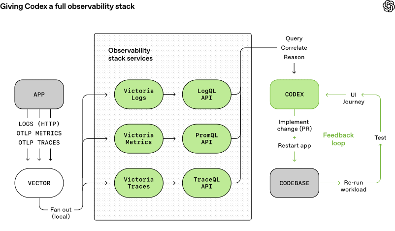

# Harness engineering: leveraging Codex in an agent-first world
# Harness 工程：在 Agent 优先的世界中运用 Codex

**By Ryan Lopopolo, Member of the Technical Staff**
**作者：Ryan Lopopolo，技术团队成员**

February 11, 2026 · Engineering
2026 年 2 月 11 日 · 工程

---

Over the past five months, our team has been running an experiment: building and shipping an internal beta of a software product with **0 lines of manually-written code**.

在过去五个月里，我们团队一直在进行一项实验：构建并交付一个内部 Beta 软件产品，全程**零行手写代码**。

---

The product has internal daily users and external alpha testers. It ships, deploys, breaks, and gets fixed. What's different is that every line of code—application logic, tests, CI configuration, documentation, observability, and internal tooling—has been written by Codex. We estimate that we built this in about 1/10th the time it would have taken to write the code by hand.

这个产品已有内部日活用户和外部 Alpha 测试用户。它正常发布、部署、出 bug、被修复。不同之处在于——每一行代码，包括应用逻辑、测试、CI 配置、文档、可观测性和内部工具，都是由 Codex 编写的。我们估计，这大约只花了手写代码所需时间的**十分之一**。

---

**Humans steer. Agents execute.**

**人类掌舵，Agent 执行。**

---

We intentionally chose this constraint so we would build what was necessary to increase engineering velocity by orders of magnitude. We had weeks to ship what ended up being a million lines of code. To do that, we needed to understand what changes when a software engineering team's primary job is no longer to write code, but to design environments, specify intent, and build feedback loops that allow Codex agents to do reliable work.

我们故意选择了这个约束条件，以此倒逼自己构建出能将工程效率提升数量级的一切必要基础设施。我们只有几周时间来交付最终达到百万行代码量级的产品。为此，我们需要理解：当一个软件工程团队的核心任务不再是写代码，而是**设计环境、明确意图、构建反馈循环**以让 Codex Agent 可靠地完成工作时，一切会发生什么变化。

---

This post is about what we learned by building a brand new product with a team of agents—what broke, what compounded, and how to maximize our one truly scarce resource: human time and attention.

这篇文章讲述的就是我们用一支 Agent 团队从零构建全新产品的过程中学到的东西——哪些事情出了问题，哪些形成了复利效应，以及如何最大化我们唯一真正稀缺的资源：**人类的时间与注意力**。

---

## We started with an empty git repository
## 我们从一个空的 Git 仓库开始

---

The first commit to an empty repository landed in late August 2025.

第一次提交到空仓库是在 2025 年 8 月下旬。

---

The initial scaffold—repository structure, CI configuration, formatting rules, package manager setup, and application framework—was generated by Codex CLI using GPT‑5, guided by a small set of existing templates. Even the initial AGENTS.md file that directs agents how to work in the repository was itself written by Codex.

初始脚手架——仓库结构、CI 配置、格式化规则、包管理器设置和应用框架——由 Codex CLI 使用 GPT-5 生成，参考了一小组已有模板。甚至连指导 Agent 如何在仓库中工作的初始 `AGENTS.md` 文件本身也是 Codex 写的。

---

There was no pre-existing human-written code to anchor the system. From the beginning, the repository was shaped by the agent.

没有任何预先存在的人工编写代码来锚定这个系统。从一开始，仓库就是由 Agent 塑造的。

---

Five months later, the repository contains on the order of a million lines of code across application logic, infrastructure, tooling, documentation, and internal developer utilities. Over that period, roughly 1,500 pull requests have been opened and merged with a small team of just three engineers driving Codex. This translates to an average throughput of 3.5 PRs per engineer per day, and surprisingly the throughput has *increased* as the team has grown to now seven engineers. Importantly, this wasn't output for output's sake: the product has been used by hundreds of users internally, including daily internal power users.

五个月后，仓库包含了大约百万行代码，涵盖应用逻辑、基础设施、工具、文档和内部开发者实用工具。在这段时间里，仅由三名工程师驱动 Codex，就开启并合并了大约 1,500 个 Pull Request。这意味着平均每位工程师每天产出 3.5 个 PR，而且令人意外的是，随着团队扩展到目前的七名工程师，产出效率反而*提高了*。重要的是，这并非为了产出而产出：这个产品已经被内部数百名用户使用，其中不乏每天都在用的深度用户。

---

Throughout the development process, humans never directly contributed any code. This became a core philosophy for the team: **no manually-written code**.

在整个开发过程中，人类从未直接贡献过任何代码。这成为了团队的核心理念：**不写任何手动代码**。

---

## Redefining the role of the engineer
## 重新定义工程师的角色

---

The lack of hands-on human coding **introduced a different kind of engineering work, focused on systems, scaffolding, and leverage**.

没有亲自编码这件事，**催生了一种截然不同的工程工作方式——聚焦于系统、脚手架和杠杆效应**。

---

Early progress was slower than we expected, not because Codex was incapable, but because the environment was underspecified. The agent lacked the tools, abstractions, and internal structure required to make progress toward high-level goals. The primary job of our engineering team became enabling the agents to do useful work.

早期进展比预期要慢，不是因为 Codex 能力不足，而是因为环境的定义不够充分。Agent 缺乏推进高层目标所需的工具、抽象和内部结构。我们工程团队的首要任务变成了：让 Agent 能够有效地开展工作。

---

In practice, this meant working depth-first: breaking down larger goals into smaller building blocks (design, code, review, test, etc), prompting the agent to construct those blocks, and using them to unlock more complex tasks. When something failed, the fix was almost never "try harder." Because the only way to make progress was to get Codex to do the work, human engineers always stepped into the task and asked: "what capability is missing, and how do we make it both legible and enforceable for the agent?"

在实践中，这意味着采用深度优先的方式：将更大的目标拆解为更小的构建模块（设计、编码、评审、测试等），提示 Agent 去构建这些模块，再用它们解锁更复杂的任务。当某件事失败时，解决方案几乎从来不是"再试一次"。因为唯一的推进方式就是让 Codex 来做，人类工程师总是会介入任务并自问："缺少什么能力？如何让它对 Agent 来说既**可读**又**可执行**？"

---

Humans interact with the system almost entirely through prompts: an engineer describes a task, runs the agent, and allows it to open a pull request. To drive a PR to completion, we instruct Codex to review its own changes locally, request additional specific agent reviews both locally and in the cloud, respond to any human or agent given feedback, and iterate in a loop until all agent reviewers are satisfied (effectively this is a Ralph Wiggum Loop). Codex uses our standard development tools directly (gh, local scripts, and repository-embedded skills) to gather context without humans copying and pasting into the CLI.

人类几乎完全通过 Prompt 与系统交互：工程师描述一个任务，运行 Agent，让它发起一个 Pull Request。为了将 PR 推进到完成，我们指示 Codex 在本地审查自己的改动，在本地和云端请求其他特定 Agent 进行评审，回应人类或 Agent 的反馈，然后在循环中不断迭代，直到所有 Agent 评审者都满意（本质上这是一个 Ralph Wiggum 循环）。Codex 直接使用我们的标准开发工具（`gh`、本地脚本和仓库内嵌的技能）来收集上下文，无需人类复制粘贴内容到 CLI 中。

---

Humans may review pull requests, but aren't required to. Over time, we've pushed almost all review effort towards being handled agent-to-agent.

人类可以审查 Pull Request，但不是必须的。随着时间推移，我们已经把几乎所有审查工作都推向了 Agent 之间互审的模式。

---

## Increasing application legibility
## 提升应用的可读性

---

As code throughput increased, our bottleneck became human QA capacity. Because the fixed constraint has been human time and attention, we've worked to add more capabilities to the agent by making things like the application UI, logs, and app metrics themselves directly legible to Codex.

随着代码产出速度的提升，我们的瓶颈变成了人类的 QA 能力。因为不变的约束条件是人类的时间与注意力，我们致力于通过让应用 UI、日志和应用指标本身直接对 Codex **可读**，来为 Agent 增加更多能力。

---

For example, we made the app bootable per git worktree, so Codex could launch and drive one instance per change. We also wired the Chrome DevTools Protocol into the agent runtime and created skills for working with DOM snapshots, screenshots, and navigation. This enabled Codex to reproduce bugs, validate fixes, and reason about UI behavior directly.

例如，我们让应用可以按 git worktree 独立启动，这样 Codex 就能为每个变更启动并驱动一个独立实例。我们还将 Chrome DevTools 协议接入了 Agent 运行时，并创建了用于处理 DOM 快照、截图和页面导航的技能。这使得 Codex 能够复现 bug、验证修复、直接推理 UI 行为。


*Codex Agent 驱动应用进行测试 — Agent 通过 Chrome DevTools 协议复现 bug、验证修复并直接推理 UI 行为。*

---

We did the same for observability tooling. Logs, metrics, and traces are exposed to Codex via a local observability stack that's ephemeral for any given worktree. Codex works on a fully isolated version of that app—including its logs and metrics, which get torn down once that task is complete. Agents can query logs with LogQL and metrics with PromQL. With this context available, prompts like "ensure service startup completes in under 800ms" or "no span in these four critical user journeys exceeds two seconds" become tractable.

我们对可观测性工具做了同样的事。日志、指标和链路追踪通过一个局部的可观测性栈暴露给 Codex，这个栈对每个 worktree 来说是临时的。Codex 在应用的一个完全隔离的版本上工作——包括它的日志和指标——任务完成后就会被销毁。Agent 可以用 LogQL 查询日志，用 PromQL 查询指标。有了这些上下文，像"确保服务启动在 800 毫秒内完成"或"这四个关键用户旅程中没有任何 span 超过两秒"这样的 Prompt 就变得可行了。


*Codex Agent 的可观测性与遥测工作流 — 日志、指标和链路追踪通过临时的本地栈暴露给 Agent，使其可以自主监控与调试。*

---

We regularly see single Codex runs work on a single task for upwards of six hours (often while the humans are sleeping).

我们经常看到单次 Codex 运行为一个任务持续工作超过六个小时（通常是在人类睡觉的时候）。

---

## We made repository knowledge the system of record
## 我们将仓库知识设为唯一信息源

---

Context management is one of the biggest challenges in making agents effective at large and complex tasks. One of the earliest lessons we learned was simple: **give Codex a map, not a 1,000-page instruction manual.**

上下文管理是让 Agent 在大型复杂任务中发挥效能的最大挑战之一。我们最早学到的一个教训很简单：**给 Codex 一张地图，而不是一本 1000 页的操作手册。**

---

We tried the "one big AGENTS.md" approach. It failed in predictable ways:

我们试过"一个巨大的 `AGENTS.md`"方案。它以可预见的方式失败了：

---

- **Context is a scarce resource.** A giant instruction file crowds out the task, the code, and the relevant docs—so the agent either misses key constraints or starts optimizing for the wrong ones.
- **Too much guidance becomes *non-guidance*.** When everything is "important," nothing is. Agents end up pattern-matching locally instead of navigating intentionally.
- **It rots instantly.** A monolithic manual turns into a graveyard of stale rules. Agents can't tell what's still true, humans stop maintaining it, and the file quietly becomes an attractive nuisance.
- **It's hard to verify.** A single blob doesn't lend itself to mechanical checks (coverage, freshness, ownership, cross-links), so drift is inevitable.

- **上下文是稀缺资源。** 一个巨大的指令文件会挤占任务本身、代码和相关文档的空间——结果 Agent 要么遗漏关键约束，要么开始优化错误的方向。
- **过多的指导等于没有指导。** 当所有东西都是"重要的"，就没有什么是重要的。Agent 最终会在局部做模式匹配，而不是有意图地导航。
- **它会立即腐化。** 一个巨型手册会变成陈旧规则的墓地。Agent 无法分辨什么还是真实有效的，人类也不再维护它，这个文件就悄悄变成了一个有害的引诱物。
- **难以验证。** 单个大块文档不适合机械化检查（覆盖率、时效性、归属、交叉引用），因此漂移是不可避免的。

---

So instead of treating AGENTS.md as the encyclopedia, we treat it as **the table of contents**.

所以我们不把 `AGENTS.md` 当作百科全书，而是把它当作**目录**。

---

The repository's knowledge base lives in a structured docs/ directory treated as the system of record. A short AGENTS.md (roughly 100 lines) is injected into context and serves primarily as a map, with pointers to deeper sources of truth elsewhere.

仓库的知识库存放在一个结构化的 `docs/` 目录中，被视为唯一的信息源。一个简短的 `AGENTS.md`（大约 100 行）被注入上下文，主要充当一张地图，指向其他地方更深层的信息源。

---

```
AGENTS.md
ARCHITECTURE.md
docs/
├── design-docs/
│   ├── index.md
│   ├── core-beliefs.md
│   └── ...
├── exec-plans/
│   ├── active/
│   ├── completed/
│   └── tech-debt-tracker.md
├── generated/
│   └── db-schema.md
├── product-specs/
│   ├── index.md
│   ├── new-user-onboarding.md
│   └── ...
├── references/
│   ├── design-system-reference-llms.txt
│   ├── nixpacks-llms.txt
│   ├── uv-llms.txt
│   └── ...
├── DESIGN.md
├── FRONTEND.md
├── PLANS.md
├── PRODUCT_SENSE.md
├── QUALITY_SCORE.md
├── RELIABILITY.md
└── SECURITY.md
```

*In-repository knowledge store layout.*
*仓库内知识库的目录结构。*

---

Design documentation is catalogued and indexed, including verification status and a set of core beliefs that define agent-first operating principles. Architecture documentation provides a top-level map of domains and package layering. A quality document grades each product domain and architectural layer, tracking gaps over time.

设计文档经过编目索引，包括验证状态和一组定义 Agent 优先运营原则的核心信念。架构文档提供了业务域和包分层的顶层地图。质量文档对每个产品域和架构层进行评分，跟踪差距随时间的变化。

---

Plans are treated as first-class artifacts. Ephemeral lightweight plans are used for small changes, while complex work is captured in execution plans with progress and decision logs that are checked into the repository. Active plans, completed plans, and known technical debt are all versioned and co-located, allowing agents to operate without relying on external context.

计划被视为一等公民。轻量的临时计划用于小型变更，而复杂工作则以执行计划的形式记录，附带进展和决策日志，并被提交到仓库。活跃计划、已完成计划和已知技术债务都被版本化并就近存放，使 Agent 可以在不依赖外部上下文的情况下运作。

---

This enables **progressive disclosure**: agents start with a small, stable entry point and are taught where to look next, rather than being overwhelmed up front.

这实现了**渐进式披露**：Agent 从一个小而稳定的入口开始，被教导接下来该去哪里查找，而不是一上来就被信息淹没。

---

We enforce this mechanically. Dedicated linters and CI jobs validate that the knowledge base is up to date, cross-linked, and structured correctly. A recurring "doc-gardening" agent scans for stale or obsolete documentation that does not reflect the real code behavior and opens fix-up pull requests.

我们通过机械化手段来强制执行这一点。专门的 Linter 和 CI 任务会验证知识库是否及时更新、是否正确交叉引用和结构化。一个定期运行的"文档整理" Agent 会扫描过时或不再反映真实代码行为的文档，并发起修复 PR。

---

## Agent legibility is the goal
## Agent 可读性是目标

---

As the codebase evolved, Codex's framework for design decisions needed to evolve, too.

随着代码库的演进，Codex 做设计决策的框架也需要随之演进。

---

Because the repository is entirely agent-generated, it's optimized first for *Codex's legibility*. In the same way teams aim to improve navigability of their code for new engineering hires, our human engineers' goal was making it possible for an agent to reason about the full business domain **directly from the repository itself.**

因为仓库完全是 Agent 生成的，它首先针对 *Codex 的可读性* 进行优化。就像团队致力于提升代码对新入职工程师的可导航性一样，我们人类工程师的目标是让 Agent 能够**直接从仓库本身推理整个业务域**。

---

From the agent's point of view, anything it can't access in-context while running effectively doesn't exist. Knowledge that lives in Google Docs, chat threads, or people's heads are not accessible to the system. Repository-local, versioned artifacts (e.g., code, markdown, schemas, executable plans) are all it can see.

从 Agent 的视角来看，任何它在运行时无法在上下文中访问的东西，实际上就不存在。存在于 Google Docs、聊天记录或人们脑中的知识，对系统来说是不可访问的。仓库本地的、版本化的产物（如代码、Markdown、Schema、可执行计划）是它能看到的全部。


*Agent 知识的边界 — Agent 只能访问仓库内的版本化产物，Google Docs、Slack 讨论和人脑中的知识对它来说都是不可见的。*

---

We learned that we needed to push more and more context into the repo over time. That Slack discussion that aligned the team on an architectural pattern? If it isn't discoverable to the agent, it's illegible in the same way it would be unknown to a new hire joining three months later.

我们发现，我们需要随时间推移将越来越多的上下文推送到仓库中。团队在 Slack 上讨论并达成一致的某个架构模式？如果 Agent 发现不了它，那就跟三个月后新入职的人完全不知道这件事一样。

---

Giving Codex more context means organizing and exposing the right information so the agent can reason over it, rather than overwhelming it with ad-hoc instructions. In the same way you would onboard a new teammate on product principles, engineering norms, and team culture (emoji preferences included), giving the agent this information leads to better-aligned output.

给 Codex 更多上下文，意味着组织和暴露正确的信息，让 Agent 可以在此基础上进行推理，而不是用临时指令去压倒它。就像你会向新团队成员介绍产品原则、工程规范和团队文化（包括 emoji 偏好）一样，给 Agent 提供这些信息会产生更加对齐的输出。

---

This framing clarified many tradeoffs. We favored dependencies and abstractions that could be fully internalized and reasoned about in-repo. Technologies often described as "boring" tend to be easier for agents to model due to composability, api stability, and representation in the training set. In some cases, it was cheaper to have the agent reimplement subsets of functionality than to work around opaque upstream behavior from public libraries. For example, rather than pulling in a generic p-limit-style package, we implemented our own map-with-concurrency helper: it's tightly integrated with our OpenTelemetry instrumentation, has 100% test coverage, and behaves exactly the way our runtime expects.

这种思维框架澄清了很多权衡。我们倾向于使用那些可以完全在仓库内被内化和推理的依赖和抽象。通常被描述为"无聊"的技术往往更容易被 Agent 建模，因为它们具有组合性、API 稳定性，并且在训练集中有大量表示。在某些情况下，让 Agent 自己重新实现功能子集，比绕过公共库不透明的上游行为要更经济。例如，我们没有引入通用的 `p-limit` 风格的包，而是实现了自己的并发映射辅助工具：它与我们的 OpenTelemetry instrumentation 紧密集成，有 100% 的测试覆盖率，并且行为完全符合我们运行时的预期。

---

Pulling more of the system into a form the agent can inspect, validate, and modify directly increases leverage—not just for Codex, but for other agents (e.g. Aardvark) that are working on the codebase as well.

将系统的更多部分拉入 Agent 可以检查、验证和直接修改的形式，会增加杠杆效应——不仅对 Codex 如此，对仓库上工作的其他 Agent（如 Aardvark）也是如此。

---

## Enforcing architecture and taste
## 强制执行架构与品味

---

Documentation alone doesn't keep a fully agent-generated codebase coherent. **By enforcing invariants, not micromanaging implementations, we let agents ship fast without undermining the foundation.** For example, we require Codex to parse data shapes at the boundary, but are not prescriptive on how that happens (the model seems to like Zod, but we didn't specify that specific library).

仅靠文档不足以让一个完全由 Agent 生成的代码库保持一致。**通过强制执行不变量，而不是微观管理具体实现，我们让 Agent 在不破坏基础的前提下快速交付。** 例如，我们要求 Codex 在边界处解析数据结构（parse, don't validate），但不规定具体怎么做（模型似乎偏好 Zod，但这不是我们指定的）。

---

Agents are most effective in environments with strict boundaries and predictable structure, so we built the application around a rigid architectural model. Each business domain is divided into a fixed set of layers, with strictly validated dependency directions and a limited set of permissible edges. These constraints are enforced mechanically via custom linters (Codex-generated, of course!) and structural tests.

Agent 在具有严格边界和可预测结构的环境中最为高效，因此我们围绕一个刚性的架构模型来构建应用。每个业务域被划分为一组固定的层，具有严格验证的依赖方向和有限的允许边集合。这些约束通过自定义 Linter（当然也是 Codex 生成的！）和结构化测试来机械地强制执行。

---

The diagram below shows the rule: within each business domain (e.g. App Settings), code can only depend "forward" through a fixed set of layers (Types → Config → Repo → Service → Runtime → UI). Cross-cutting concerns (auth, connectors, telemetry, feature flags) enter through a single explicit interface: Providers. Anything else is disallowed and enforced mechanically.

规则如下：在每个业务域（例如应用设置）内，代码只能沿着固定的层级序列"向前"依赖（Types → Config → Repo → Service → Runtime → UI）。横切关注点（认证、连接器、遥测、功能开关）通过一个明确的单一接口进入：Providers。其他一切都是不允许的，并被机械地强制执行。


*分层域架构与显式横切边界 — 每个业务域内代码只能沿固定层级序列向前依赖（Types → Config → Repo → Service → Runtime → UI），横切关注点通过 Providers 单一接口进入。*

---

This is the kind of architecture you usually postpone until you have hundreds of engineers. With coding agents, it's an early prerequisite: the constraints are what allows speed without decay or architectural drift.

这种架构通常要等到有数百名工程师时才会去做。但在使用 Agent 编码的场景下，它是一个早期的前提条件：正是这些约束使得速度不会带来衰退或架构漂移。

---

In practice, we enforce these rules with custom linters and structural tests, plus a small set of "taste invariants." For example, we statically enforce structured logging, naming conventions for schemas and types, file size limits, and platform-specific reliability requirements with custom lints. Because the lints are custom, we write the error messages to inject remediation instructions into agent context.

在实践中，我们通过自定义 Linter 和结构化测试，加上一小组"品味不变量"来强制执行这些规则。例如，我们静态地强制执行结构化日志、Schema 和类型的命名约定、文件大小限制，以及特定平台的可靠性要求。因为 Linter 是自定义的，我们将错误消息编写为直接向 Agent 上下文注入修复指导。

---

In a human-first workflow, these rules might feel pedantic or constraining. With agents, they become multipliers: once encoded, they apply everywhere at once.

在人类优先的工作流中，这些规则可能显得迂腐或束缚。但对 Agent 来说，它们是乘数：一旦编码完成，就能立即在所有地方生效。

---

At the same time, we're explicit about where constraints matter and where they do not. This resembles leading a large engineering platform organization: enforce boundaries centrally, allow autonomy locally. You care deeply about boundaries, correctness, and reproducibility. Within those boundaries, you allow teams—or agents—significant freedom in how solutions are expressed.

与此同时，我们明确了约束在哪里重要、在哪里不重要。这就像领导一个大型工程平台组织：在中心层面强制执行边界，在局部允许自主权。你非常在意边界、正确性和可复现性。在这些边界之内，你允许团队——或 Agent——在解决方案的表达方式上拥有相当大的自由度。

---

The resulting code does not always match human stylistic preferences, and that's okay. As long as the output is correct, maintainable, and legible to future agent runs, it meets the bar.

生成的代码并不总是符合人类的风格偏好，这没关系。只要输出是正确的、可维护的，并且对未来的 Agent 运行可读，它就达标了。

---

Human taste is fed back into the system continuously. Review comments, refactoring pull requests, and user-facing bugs are captured as documentation updates or encoded directly into tooling. When documentation falls short, we promote the rule into code.

人类品味通过持续反馈注入系统。评审评论、重构 PR 和面向用户的 bug 被捕获为文档更新或直接编码到工具中。当文档不足时，我们就把规则升级为代码。

---

## Throughput changes the merge philosophy
## 高产出改变了合并哲学

---

As Codex's throughput increased, many conventional engineering norms became counterproductive.

随着 Codex 产出的增加，许多传统的工程规范变得适得其反。

---

The repository operates with minimal blocking merge gates. Pull requests are short-lived. Test flakes are often addressed with follow-up runs rather than blocking progress indefinitely. In a system where agent throughput far exceeds human attention, corrections are cheap, and waiting is expensive.

仓库以最少的阻塞性合并门控来运作。Pull Request 的生命周期很短。测试的偶发失败通常通过后续运行来解决，而不是无限期地阻塞进度。在一个 Agent 产出远超人类注意力的系统中，纠错成本低，而等待成本高。

---

This would be irresponsible in a low-throughput environment. Here, it's often the right tradeoff.

在低产出环境中这样做是不负责任的。但在这里，这往往是正确的权衡。

---

## What "agent-generated" actually means
## "Agent 生成"到底意味着什么

---

When we say the codebase is generated by Codex agents, we mean everything in the codebase.

当我们说代码库是由 Codex Agent 生成时，我们指的是代码库中的**一切**。

---

Agents produce:

- Product code and tests
- CI configuration and release tooling
- Internal developer tools
- Documentation and design history
- Evaluation harnesses
- Review comments and responses
- Scripts that manage the repository itself
- Production dashboard definition files

Agent 产出包括：

- 产品代码和测试
- CI 配置和发布工具
- 内部开发者工具
- 文档和设计历史
- 评估 Harness
- 代码评审评论和回复
- 管理仓库本身的脚本
- 生产环境监控面板定义文件

---

Humans always remain in the loop, but work at a different layer of abstraction than we used to. We prioritize work, translate user feedback into acceptance criteria, and validate outcomes. When the agent struggles, we treat it as a signal: identify what is missing—tools, guardrails, documentation—and feed it back into the repository, always by having Codex itself write the fix.

人类始终在环路中，只是工作在不同于以往的抽象层。我们确定工作优先级，将用户反馈转化为验收标准，验证结果。当 Agent 遇到困难时，我们将其视为一个信号：识别缺少什么——工具、防护栏、文档——然后将其反馈到仓库中，始终由 Codex 自己来编写修复。

---

Agents use our standard development tools directly. They pull review feedback, respond inline, push updates, and often squash and merge their own pull requests.

Agent 直接使用我们的标准开发工具。它们拉取评审反馈，内联回复，推送更新，并且经常自己 squash 并合并自己的 Pull Request。

---

## Increasing levels of autonomy
## 不断提升的自主程度

---

As more of the development loop was encoded directly into the system—testing, validation, review, feedback handling, and recovery—the repository recently crossed a meaningful threshold where Codex can end-to-end drive a new feature.

随着开发循环的更多环节被直接编码到系统中——测试、验证、评审、反馈处理和恢复——仓库最近跨过了一个有意义的门槛：Codex 可以端到端地驱动一个新功能的完成。

---

Given a single prompt, the agent can now:

- Validate the current state of the codebase
- Reproduce a reported bug
- Record a video demonstrating the failure
- Implement a fix
- Validate the fix by driving the application
- Record a second video demonstrating the resolution
- Open a pull request
- Respond to agent and human feedback
- Detect and remediate build failures
- Escalate to a human only when judgment is required
- Merge the change

给定一个 Prompt，Agent 现在可以：

- 验证代码库的当前状态
- 复现一个已报告的 bug
- 录制一段视频展示失败场景
- 实现修复
- 通过驱动应用来验证修复
- 录制第二段视频展示修复效果
- 发起一个 Pull Request
- 回应 Agent 和人类的反馈
- 检测并修复构建失败
- 仅在需要人类判断时才上报
- 合并变更

---

This behavior depends heavily on the specific structure and tooling of this repository and should not be assumed to generalize without similar investment—at least, not yet.

这种行为高度依赖于这个特定仓库的结构和工具，不应假设可以在没有类似投入的情况下泛化——至少目前还不行。

---

## Entropy and garbage collection
## 熵与垃圾回收

---

**Full agent autonomy also introduces novel problems.** Codex replicates patterns that already exist in the repository—even uneven or suboptimal ones. Over time, this inevitably leads to drift.

**完全的 Agent 自主权也引入了新的问题。** Codex 会复制仓库中已存在的模式——即使是不均匀或不够优的模式。随着时间推移，这不可避免地导致漂移。

---

Initially, humans addressed this manually. Our team used to spend every Friday (20% of the week) cleaning up "AI slop." Unsurprisingly, that didn't scale.

最初，人类手动解决这个问题。我们团队过去每周五（一周的 20%）都在清理"AI 垃圾"。不出所料，这种方式无法扩展。

---

Instead, we started encoding what we call "golden principles" directly into the repository and built a recurring cleanup process. These principles are opinionated, mechanical rules that keep the codebase legible and consistent for future agent runs. For example: (1) we prefer shared utility packages over hand-rolled helpers to keep invariants centralized, and (2) we don't probe data "YOLO-style"—we validate boundaries or rely on typed SDKs so the agent can't accidentally build on guessed shapes. On a regular cadence, we have a set of background Codex tasks that scan for deviations, updates quality grades, and open targeted refactoring pull requests. Most of these can be reviewed in under a minute and automerged.

取而代之的是，我们开始将我们称之为"黄金准则"的东西直接编码到仓库中，并构建了一个定期清理流程。这些准则是有主见的、机械化的规则，用于保持代码库对未来 Agent 运行的可读性和一致性。例如：（1）我们偏好共享工具包而不是手写的辅助函数，以使不变量保持集中化；（2）我们不以"YOLO 风格"探查数据——我们在边界处进行验证或依赖类型化的 SDK，这样 Agent 就不会意外地基于猜测的数据结构进行构建。按照固定的节奏，我们有一组后台 Codex 任务来扫描偏差、更新质量评分，并发起有针对性的重构 PR。大多数可以在一分钟内完成评审并自动合并。

---

This functions like garbage collection. Technical debt is like a high-interest loan: it's almost always better to pay it down continuously in small increments than to let it compound and tackle it in painful bursts. Human taste is captured once, then enforced continuously on every line of code. This also lets us catch and resolve bad patterns on a daily basis, rather than letting them spread in the code base for days or weeks.

这就像垃圾回收一样运作。技术债务就像高利贷：几乎总是以小额增量持续偿还比让它复利增长后再痛苦地集中处理要好。人类品味只需捕获一次，然后持续地在每一行代码上强制执行。这也让我们能够在每天的基础上捕获和解决坏的模式，而不是让它们在代码库中扩散数天或数周。

---

## What we're still learning
## 我们仍在学习的事情

---

This strategy has so far worked well up through internal launch and adoption at OpenAI. Building a real product for real users helped anchor our investments in reality and guide us towards long-term maintainability.

到目前为止，这个策略在 OpenAI 内部的发布和采纳中运行良好。为真实用户构建真实产品帮助我们将投入锚定在现实中，并引导我们迈向长期可维护性。

---

What we don't yet know is how architectural coherence evolves over years in a fully agent-generated system. We're still learning where human judgment adds the most leverage and how to encode that judgment so it compounds. We also don't know how this system will evolve as models continue to become more capable over time.

我们尚不知道的是，在一个完全由 Agent 生成的系统中，架构一致性在数年后会如何演变。我们仍在学习人类判断在哪里产生最大杠杆效应，以及如何将这些判断编码使其产生复利。我们也不知道随着模型持续变得更强大，这个系统将如何演化。

---

What's become clear: building software still demands discipline, but the discipline shows up more in the scaffolding rather than the code. The tooling, abstractions, and feedback loops that keep the codebase coherent are increasingly important.

但有一件事已经变得清晰：构建软件仍然需要纪律，但纪律更多地体现在脚手架上，而不是代码上。保持代码库一致性的工具、抽象和反馈循环变得越来越重要。

---

**Our most difficult challenges now center on designing environments, feedback loops, and control systems** that help agents accomplish our goal: build and maintain complex, reliable software at scale.

**我们现在最困难的挑战集中在设计环境、反馈循环和控制系统上**，以帮助 Agent 实现我们的目标：大规模构建和维护复杂、可靠的软件。

---

As agents like Codex take on larger portions of the software lifecycle, these questions will matter even more. We hope that sharing some early lessons helps you reason about where to invest your effort so you can just build things.

随着像 Codex 这样的 Agent 承担软件生命周期中越来越大的份额，这些问题将变得更加重要。我们希望分享一些早期经验，能帮助你思考应该把精力投入到哪里——然后放手去造。

---

*Author: Ryan Lopopolo*
*作者：Ryan Lopopolo*

*Acknowledgements: Special thanks to Victor Zhu and Zach Brock who contributed to the post, as well as to the entire team that built this new product.*
*致谢：特别感谢 Victor Zhu 和 Zach Brock 对本文的贡献，以及构建这个新产品的整个团队。*

*Original: https://openai.com/index/harness-engineering/*
*原文链接：https://openai.com/index/harness-engineering/*
